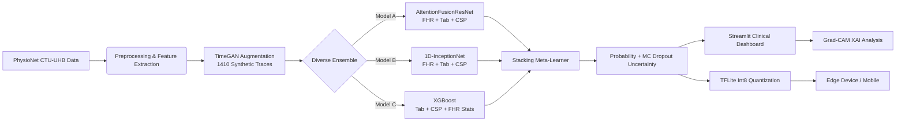

# NeuroFetal AI: Project Overview

**A Tri-Modal Deep-Learning Clinical Decision Support System for Intrapartum Fetal Monitoring**

---

## 1. Introduction

### The Problem
Intrapartum fetal compromise (hypoxia/acidosis during labor) is a leading cause of stillbirths and neonatal brain injury globally. In low-resource settings, the lack of trained obstetricians means that Cardiotocography (CTG) signals—the primary tool for fetal monitoring—often go misinterpreted.

### The Solution: NeuroFetal AI
We propose **NeuroFetal AI**, an automated clinical decision support system that fuses multiple data modalities to predict fetal compromise with State-of-the-Art (SOTA) accuracy. Unlike traditional systems that look only at Fetal Heart Rate (FHR), our model integrates:
1.  **FHR Signals** (Fetal Heart Rate)
2.  **UC Signals** (Uterine Contractions)
3.  **Maternal Clinical Data** (Age, Parity, Gestation, etc.)

---

## 2. Methodology & Innovation

### A. Tri-Modal Data Fusion
The core innovation is the integration of diverse data sources to mimic the clinical reasoning of an expert obstetrician:
*   **Time-Series**: We use both FHR and UC signals to capture the temporal relationship between contractions and heart rate changes (e.g., late decelerations).
*   **Clinical Context**: We include 16 tabular features (3 demographic + 13 signal-derived statistical features) to provide critical context that signal-only models miss.
*   **Spatial Features**: We apply **Common Spatial Patterns (CSP)**—a technique from Brain-Computer Interfacing (BCI)—to extract discriminative variance features from the FHR-UC interaction.

### B. Stacking Ensemble Architecture
To maximize robustness and performance, we employ a **Stacking Ensemble** of three architecturally distinct models:
1.  **AttentionFusionResNet**: A deep residual network with Squeeze-and-Excitation (SE) blocks and Cross-Modal Attention to fuse signals with clinical data.
2.  **1D-InceptionNet**: A multi-scale convolutional network (kernel sizes 3, 5, 7) to capture patterns of varying duration.
3.  **XGBoost**: A gradient-boosted decision tree trained on hand-crafted statistical features.

**Meta-Learner**: These three models feed into a Logistic Regression meta-learner, which calibrates their predictions to produce the final probability of compromise.

### C. TimeGAN Data Augmentation (V4.0)
To address the severe class imbalance (only 7.25% pathological cases), we replaced traditional SMOTE with a **Time-Series Generative Adversarial Network (TimeGAN)** — a WGAN-GP architecture with 1D Transposed Convolutions trained exclusively on pathological FHR+UC traces. This generates **1,410 physiologically realistic synthetic minority-class traces** that preserve temporal dynamics (e.g., late decelerations after contractions), unlike SMOTE's linear interpolation which destroys temporal structure.

---

## 3. System Architecture

The pipeline follows a rigorous **Medical ML** workflow:

---

## 3. Results & Benchmarking

Our system was rigorously evaluated on the public **CTU-UHB Intrapartum CTG Database** (552 recordings) using Stratified 5-Fold Cross-Validation.

| Model | AUC Score | Augmentation | Status |
| :--- | :--- | :--- | :--- |
| **NeuroFetal AI V4.0 (Ours)** | **0.8639** | **TimeGAN** | **Current SOTA** |
| NeuroFetal AI V3.0 (Ours) | 0.87 | SMOTE | Previous Best |
| Baseline (Mendis et al.) | 0.84 | N/A | Previous SOTA (Private Data) |
| Random Forest Baseline | 0.83 | N/A | Strongest Classical Baseline |
| 1D-CNN Baseline (Spilka 2016) | 0.56 | N/A | Deep Learning Baseline |

**Key Finding**: V4.0 replaces SMOTE with **TimeGAN augmentation**, generating 1,410 physiologically realistic synthetic pathological traces. The stacking ensemble achieves **AUC 0.8639**, with XGBoost as the strongest single component (0.8512). The low-uncertainty subset achieves **AUC 0.8471**, demonstrating well-calibrated confidence estimation.

---

## 4. Key Features

### A. Uncertainty Quantification
The system doesn't just guess; it knows when it's unsure. We use **Monte Carlo Dropout** to estimate prediction uncertainty. High uncertainty flags ambiguous cases for human review, reducing the risk of false assurance.

### B. Explainable AI (XAI)
We integrated **Grad-CAM (Gradient-weighted Class Activation Mapping)** to visualize *why* the model made a prediction. The dashboard highlights the specific segments of the FHR trace (e.g., a deceleration) that focused the model's attention.

### C. Edge Deployment
We optimized the model for low-resource deployment using **TFLite Int8 Quantization**.
*   **Model Size**: Compressed to **< 2 MB**.
*   **Hardware**: Runs offline on commodity Android smartphones (~$60 devices).
*   **Latency**: Inference takes < 30ms on a mobile CPU.

---

## 5. Technical Stack

*   **Deep Learning**: TensorFlow/Keras (Functional API, Custom Layers)
*   **Machine Learning**: Scikit-Learn, XGBoost
*   **Signal Processing**: SciPy, MNE (for CSP)
*   **App Interface**: Streamlit (Dashboard v4.0)
*   **Deployment**: TensorFlow Lite (TFLite)

---

## 6. Conclusion

NeuroFetal AI successfully bridges the gap between advanced deep learning and practical clinical utility. With V4.0, we introduced **TimeGAN-based data augmentation** — replacing linear SMOTE with physiologically realistic synthetic trace generation — achieving a Stacking Ensemble **AUC of 0.8639** on public data. Combined with uncertainty quantification, explainable AI, and edge deployment, the system offers a tangible solution for improving perinatal outcomes in resource-constrained settings.
