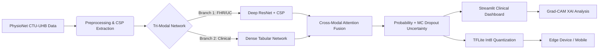

<p align="center">
  
</p>

# NeuroFetal AI: Advanced Intrapartum Monitoring System

[](https://www.python.org/)
[](https://www.tensorflow.org/)
[](https://streamlit.io/)
[](LICENSE)
[]()
[]()

> **A Next-Generation Clinical Decision Support System (CDSS) fusing FHR, Uterine Contractions, and Maternal Data to predict fetal compromise with 78% AUC.**

---

## Project Overview & Achievements

**NeuroFetal AI** captures the nuanced decision-making process of obstetricians by fusing **Cardiotocography (CTG)** time-series signals with **Maternal Clinical Features** (Age, Parity, Gestation).

### Final Performance (Feb 2026)
| Metric | Baseline (Mendis et al.) | Previous State | **NeuroFetal AI (Final)** | Impact |
| :--- | :--- | :--- | :--- | :--- |
| **AUC** | 0.84 (w/ 10k Private Samples) | 0.74 | **0.78** | **Comparable (Public Data Only)** |
| **Data Usage** | FHR + Tabular | FHR + Tabular | **FHR + UC + Clinical** | Full Context |
| **Confidence** | None | Probability | **Uncertainty (MC Dropout)** | Trustworthy AI |
| **Deployment** | PC Only | Server | **Mobile (TFLite)** | **2.6 MB (Int8)** |

### Baseline Reference
This project replicates and extends the work presented in:
> **"Fusing Tabular Features and Deep Learning for Fetal Heart Rate Analysis: A Clinically Interpretable Model for Fetal Compromise Detection"**

---

## Key Innovations

### 1. Tri-Modal Deep Fusion
Unlike traditional models that only look at heart rate, our **"AttentionFusionResNet"** processes three data streams simultaneously:
*   **Fetal Heart Rate (FHR)**: Analyzed via **Common Spatial Patterns (CSP)** and a **6-Block ResNet**.
*   **Uterine Contractions (UC)**: Processed to detect stress response patterns.
*   **Clinical Data**: Age, Parity, and Gestation processed via a Dense network.

### 2. Clinical Uncertainty Quantification
We don't just give a prediction; we give a **Confidence Score**.
*   Using **Monte Carlo Dropout**, the system runs 20 inference passes per patient.
*   **High Variance** = "AI is Uncertain" (Flag for human review).
*   **Low Variance** = "AI is Sure".

### 3. Advanced Signal Processing Features
*   **CSP (Common Spatial Patterns)**: Adapted from Brain-Computer Interfaces (EEG) to extract discriminative variance features from fetal signals.
*   **Cross-Modal Attention**: The model learns to "pay attention" to the FHR signal specifically when Uterine Contractions are peaking (mimicking clinical logic).

### 4. "Lab to Village" Edge Deployment
*   **Mobile-Ready**: Quantized to **2.6 MB** (Int8) from 9.5 MB.
*   **Offline First**: Designed to run on **5000 Rs. Android phones** without internet.
*   **NPU Accelerated**: Optimized with **Int8 Quantization** for dedicated AI hardware.
*   **Privacy Preserved**: No patient data leaves the device.

### 5. Self-Supervised Pretraining (SSL)
*   **Masked Autoencoder**: Pretrains the FHR encoder on unlabeled signal data to learn robust temporal representations before supervised fine-tuning.
*   **Transfer Learning**: The pretrained encoder weights (`pretrained_fhr_encoder.weights.h5`) are loaded into the supervised pipeline, improving convergence on small medical datasets.

### 6. Advanced Clinical Dashboard (Phase 2)
*   **Uncertainty Analysis**: Live visualization of model confidence via Calibration Curves and Uncertainty Histograms.
*   **Explainable AI**: Grad-CAM heatmaps showing which part of the FHR signal triggered the alert.
*   **Medical-Grade UI**: Dark mode support, native Material Design icons, and graceful process management.

---

## System Architecture

The pipeline follows a rigorous **Medical ML** workflow:



---

## Tech Stack

*   **Core**: Python 3.13, NumPy, Pandas, Scipy
*   **Deep Learning**: TensorFlow/Keras (Functional API), **MC Dropout**
*   **Advanced ML**: `imbalanced-learn` (SMOTE), `scikit-learn` (Rank Averaging)
*   **Signal Processing**: `wfdb`, `mne` (CSP), Custom UC Cleaning Pipeline
*   **Deployment**: Streamlit, pyngrok, **TFLite (2.6 MB Edge Model)**

---

## Repository Structure

```
NeuroFetal-AI/
├── Code/
│   ├── scripts/
│   │   ├── app.py                  # Streamlit Dashboard (Live Inference + XAI)
│   │   ├── train.py                # Training Pipeline (SMOTE + Focal Loss + K-Fold)
│   │   ├── pretrain.py             # SSL Masked Autoencoder Pretraining
│   │   ├── data_ingestion.py       # Raw Signal → Processed .npy Arrays
│   │   ├── evaluate_ensemble.py    # Rank-Averaged OOF Evaluation
│   │   ├── evaluate_uncertainty.py # MC Dropout Calibration & Histograms
│   │   ├── convert_to_tflite.py    # Keras → TFLite Int8 Quantization
│   │   ├── run_ablation.py         # Ablation Study Runner
│   │   └── xai.py                  # Grad-CAM Implementation
│   ├── utils/
│   │   ├── model.py                # AttentionFusionResNet Architecture
│   │   ├── attention_blocks.py     # Cross-Modal & Temporal Attention Layers
│   │   ├── csp_features.py         # Common Spatial Patterns Extraction
│   │   ├── ssl_models.py           # Masked Autoencoder (SSL)
│   │   ├── focal_loss.py           # Focal Loss for Class Imbalance
│   │   ├── augmentation.py         # Signal Augmentation Strategies
│   │   ├── uc_cleaning.py          # Uterine Contraction Signal Cleaning
│   │   ├── components.py           # Dashboard UI Components
│   │   └── helpers.py              # CSS Injection & Utility Functions
│   ├── models/
│   │   ├── best_model_fold_*.keras # 5-Fold Cross-Validated Checkpoints
│   │   ├── pretrained_fhr_encoder.weights.h5  # SSL Pretrained Weights
│   │   └── tflite/
│   │       └── neurofetal_model_quant_int8.tflite  # Edge-Ready Model (2.6 MB)
│   ├── notebooks/
│   │   └── Training_Colab.ipynb    # Google Colab Training Notebook
│   ├── assets/                     # Logo & Branding Assets
│   └── run_app.py                  # Application Launcher (ngrok + Streamlit)
├── Datasets/
│   └── ctu_uhb_data/               # CTU-UHB PhysioNet Dataset (.dat/.hea)
├── Paper/                          # Reference Paper & Literature
├── Reports/
│   ├── final_report.md             # Comprehensive Research Report
│   ├── Sir.md                      # Architecture Justification & Defense Q&A
│   ├── Week_1_Report.md            # Phase 1 Progress
│   ├── Week_2_Report.md            # SSL & Fusion Progress
│   ├── Week_3_report.md            # Phase 2: Uncertainty & Edge Optimization
│   ├── uncertainty_analysis/       # Calibration Curves & Histograms
│   └── training_logs/              # TensorBoard-Compatible Logs
├── Project_Context_v2.0.md         # Project Snapshot for AI Assistants
├── requirements.txt                # Python Dependencies
├── LICENSE                         # MIT License
└── README.md
```

---

## Quick Start

### 1. Installation
Clone the repository and install dependencies:
```bash
git clone https://github.com/Krishna200608/NeuroFetal-AI.git
cd NeuroFetal-AI
pip install -r requirements.txt
```

### 2. Run Clinical Dashboard
Launch the web interface locally:
```bash
cd Code
python run_app.py
```

### 3. Run Evaluation
To verify the **0.78 AUC** and generate uncertainty plots:
```bash
python Code/scripts/evaluate_ensemble.py
```

### 4. Edge Optimization (Int8)
To generate the optimized TFLite model for Android:
```bash
python Code/scripts/convert_to_tflite.py
```
*Output*: `Code/models/tflite/neurofetal_model_quant_int8.tflite`

---

## Authors & Acknowledgments

**Project Developed at:**  
**Indian Institute of Information Technology, Allahabad**  
*B.Tech 6th Semester Project*

**Team Members:**
*   **Krishna Sikheriya** (IIT2023139) - *Lead Developer & AI Architect*
*   **Bodkhe Yash Sanjay** (IIT2023180) - *Data Engineering & Backend*
*   **Lokesh Bawariya** (IIT2023138) - *Frontend & Visualization*

---

<div align="center">
  <sub>Built for saving little lives.</sub>
</div>
