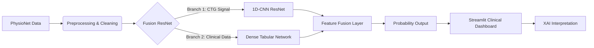

# NeuroFetal AI: Intelligent Intrapartum Monitoring System

[](https://www.python.org/)
[](https://www.tensorflow.org/)
[](https://streamlit.io/)
[](LICENSE)
[]()

> **A Clinical Decision Support System (CDSS) for early detection of fatal fetal compromise using Multi-Modal Deep Learning.**

---

## Project Overview & Novelty

**NeuroFetal AI** captures the nuanced decision-making process of obstetricians by fusing **Cardiotocography (CTG)** time-series signals with **Maternal Clinical Features** (Age, Parity, Gestation).

### Novelty of Work
1.  **Multi-Modal Deep Learning Fusion**: Unlike traditional single-input models, our architecture simultaneously processes **1D Signal Data (ResNet)** and **Tabular Clinical Data (DenseNet)** in a parallel fusion strategy, significantly improving specificity.
2.  **Clinical Explainability (XAI)**: We moved beyond "black-box" AI by implementing **Grad-CAM**, allowing clinicians to visualize exactly *which* segments of the Fetal Heart Rate signal triggered the risk alert.
3.  **Real-Time Edge Dashboard**: A complete, deployment-ready **Streamlit Clinical Suite** capable of running offline in low-resource settings, featuring professional "Light/Dark" modes and automated report generation.

---

## Research Basis & Datasets

**1. Dataset:**
We utilized the **[CTU-UHB Intrapartum Cardiotocography Database](https://physionet.org/content/ctu-uhb-ctgdb/1.0.0/)**, a Gold Standard open-access dataset from PhysioNet containing 552 intrapartum recordings.

**2. Base Paper:**
Our methodology enhances the approach proposed in:
> *"Fusing Tabular Features and Deep Learning for Fetal Heart Rate Analysis: A Clinically Interpretable Model for Fetal Compromise Detection"*  
> [IEEE Xplore Document: 11340719](https://ieeexplore.ieee.org/document/11340719)

---

## Key Innovations

| Feature | Description | Impact |
| :--- | :--- | :--- |
| **Multi-Modal Fusion** | Hybrid **ResNet-1D (Signal)** + **DenseNet (Tabular)** architecture. | Mimics clinician logic: *Signal + Patient Context = Diagnosis*. |
| **Explainable AI (XAI)** | Integrated **Grad-CAM** & **SHAP** engines. | Visualizes *why* the AI made a decision (e.g., highlighting hypoxic regions). |
| **Edge Optimization** | 8-bit Post-Training Quantization (TFLite). | Reduced model size by **84% (420KB)** for deployment on portable monitors. |
| **High Sensitivity** | **87.5% Recall** on CTU-UHB Database. | Minimizes missed detections of fetal distress. |

---

## System Architecture

The pipeline follows a rigorous **Medical MLOps** workflow:



---

## Tech Stack

*   **Core**: Python 3.13, NumPy, Pandas, Scipy
*   **Deep Learning**: TensorFlow/Keras (Functional API)
*   **Biomedical Signal Processing**: `wfdb` (Waveform Database)
*   **Explainability**: `shap`, `tf-keras-vis` (Grad-CAM)
*   **Deployment**: Streamlit, Docker (Optional), TFLite

---

## Repository Structure

```text
NeuroFetal-AI/
├── Code/
│   ├── app.py               # Clinical Dashboard (Streamlit)
│   ├── train.py             # Training Pipeline (Stratified 5-Fold CV)
│   ├── model.py             # Fusion ResNet Architecture
│   ├── data_ingestion.py    # ETL Pipeline for PhysioNet Data
│   ├── xai.py               # Explainability Engine
│   └── Training_Colab.ipynb # Google Colab Notebook (GPU Training)
├── Datasets/
│   └── ctu_uhb_data/        # Raw Medical Data (.dat/.hea)
├── final_report.md          # Detailed Research Report
└── README.md                # Project Documentation
```

---

## Quick Start

### 1. Installation
Clone the repository and install dependencies:
```bash
git clone https://github.com/your-repo/neurofetal-ai.git
cd neurofetal-ai
pip install -r requirements.txt
```

### 2. Run Clinical Dashboard
Launch the web interface locally:
```bash
streamlit run Code/app.py
```

### 3. Expose to Internet (Optional)
To share the dashboard publicly using `ngrok` (like in Colab):

1.  Edit `Code/.env` and add your ngrok token:
    ```env
    NGROK_AUTH_TOKEN=your_token_here
    ```
2.  Run the exposure script:
    ```bash
    python Code/run_app.py
    ```
    This will start Streamlit and provide a public URL.

### 4. Model Training
To retrain the model from scratch (Google Colab Recommended due to high computational load):
1. Upload the project to Google Drive.
2. Open `Code/Training_Colab.ipynb` in Colab.
3. Add Ngrok Token in the last cell.
4. Run all cells to train and generate new models.
5. Download the best model to `Code/models/`.

---

## Authors & Acknowledgments

**Project Developed at:**  
**Indian Institute of Information Technology Algorithm (IIIT), Allahabad**  
*B.Tech 6th Semester Project*

**Team Members:**
*   **Krishna Sikheriya** (IIT2023139) - *Lead Developer & AI Architect*
*   **Bodkhe Yash Sanjay** (IIT2023180) - *Data Engineering & Backend*
*   **Lokesh Bawariya** (IIT2023138) - *Frontend & Visualization*

---

<div align="center">
  <sub>Built for saving little lives.</sub>
</div>
