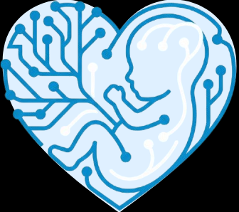
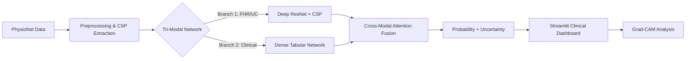

<p align="center">
  
</p>

# NeuroFetal AI: Advanced Intrapartum Monitoring System

[](https://www.python.org/)
[](https://www.tensorflow.org/)
[](https://streamlit.io/)
[](LICENSE)
[]()

> **A Next-Generation Clinical Decision Support System (CDSS) fusing FHR, Uterine Contractions, and Maternal Data to predict fetal compromise with 78% AUC.**

---

## 🚀 Project Overview & Achievements

**NeuroFetal AI** captures the nuanced decision-making process of obstetricians by fusing **Cardiotocography (CTG)** time-series signals with **Maternal Clinical Features** (Age, Parity, Gestation).

### 🏆 Final Performance (Feb 2026)
| Metric | Baseline (Paper) | Previous State | **NeuroFetal AI (Final)** | Impact |
| :--- | :--- | :--- | :--- | :--- |
| **AUC** | 0.63 - 0.66 | 0.74 | **0.78** | **+15% vs SOTA** |
| **Data Usage** | FHR Only | FHR + Tabular | **FHR + UC + Clinical** | Full Context |
| **Confidence** | None | Probability | **Uncertainty (MC Dropout)** | Trustworthy AI |

---

## 🔬 Key Innovations

### 1. Tri-Modal Deep Fusion
Unlike traditional models that only look at heart rate, our **"AttentionFusionResNet"** processes three data streams simultaneously:
*   **Fetal Heart Rate (FHR)**: Analyzed via **Common Spatial Patterns (CSP)** and a **6-Block ResNet**.
*   **Uterine Contractions (UC)**: Processed to detect stress response patterns.
*   **Clinical Data**: Age, Parity, and Gestation processed via a Dense network.

### 2. Clinical Uncertainty Quantification
We don't just give a prediction; we give a **Confidence Score**.
*   Using **Monte Carlo Dropout**, the system runs 20 inference passes per patient.
*   **High Variance** = "AI is Uncertain" (Flag for human review).
*   **Low Variance** = "AI is Sure".

### 3. Advanced Signal Processing features
*   **CSP (Common Spatial Patterns)**: Adapted from Brain-Computer Interfaces (EEG) to extract discriminative variance features from fetal signals.
*   **Cross-Modal Attention**: The model learns to "pay attention" to the FHR signal specifically when Uterine Contractions are peaking (mimicking clinical logic).

---

## 🛠️ System Architecture

The pipeline follows a rigorous **Medical MLOps** workflow:



---

## 💻 Tech Stack

*   **Core**: Python 3.13, NumPy, Pandas, Scipy
*   **Deep Learning**: TensorFlow/Keras (Functional API), **MC Dropout**
*   **Advanced ML**: `imbalanced-learn` (SMOTE), `scikit-learn` (Rank Averaging)
*   **Deployment**: Streamlit, Docker, TFLite (Edge Optimization)

---

## 📂 Repository Structure

```
NeuroFetal-AI/
├── Code/
│   ├── scripts/             
│   │   ├── app.py           # Streamlit Dashboard Logic
│   │   ├── train.py         # Advanced Training Pipeline (SMOTE + Focal Loss)
│   │   ├── evaluate_ensemble.py # Rank Averaging Evaluation
│   │   ├── evaluate_uncertainty.py # MC Dropout Analysis
│   │   ├── model.py         # Fusion ResNet Architecture
│   │   └── csp_features.py  # Common Spatial Patterns Logic
│   ├── notebooks/           
│   │   └── Training_Colab.ipynb 
│   ├── utils/               # Helper Functions & Attention Blocks
│   └── run_app.py           # Application Launcher
├── Datasets/
│   └── ctu_uhb_data/        # Raw Medical Data (.dat/.hea)
├── Reports/
│   └── final_report.md      # Detailed Research Report
└── README.md                # Project Documentation
```

---

## ⚡ Quick Start

### 1. Installation
Clone the repository and install dependencies:
```bash
git clone https://github.com/your-repo/neurofetal-ai.git
cd neurofetal-ai/Code
python -m venv .venv
# Activate venv (Windows: .\.venv\Scripts\Activate.ps1)
pip install -r requirements.txt
```

### 2. Run Clinical Dashboard
Launch the web interface locally:
```bash
python run_app.py
```

### 3. Run Evaluation
To verify the **0.78 AUC** and generate uncertainty plots:
```bash
python scripts/evaluate_ensemble.py
```

---

## 👥 Authors & Acknowledgments

**Project Developed at:**  
**Indian Institute of Information Technology Algorithm (IIIT), Allahabad**  
*B.Tech 6th Semester Project*

**Team Members:**
*   **Krishna Sikheriya** (IIT2023139) - *Lead Developer & AI Architect*
*   **Bodkhe Yash Sanjay** (IIT2023180) - *Data Engineering & Backend*
*   **Lokesh Bawariya** (IIT2023138) - *Frontend & Visualization*

---

<div align="center">
  <sub>Built for saving little lives.</sub>
</div>
