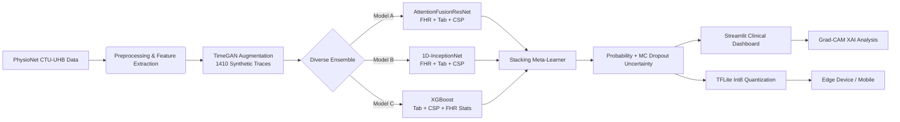

<p align="center">
  
</p>

<h1 align="center">NeuroFetal AI</h1>
<p align="center"><b>Advanced Intrapartum Fetal Monitoring · Clinical Decision Support · Edge AI</b></p>

<p align="center">
  <a href="https://www.python.org/"></a>
  <a href="https://www.tensorflow.org/"></a>
  <a href="https://streamlit.io/"></a>
  <a href="LICENSE"></a>
  
  
  
  
</p>

<p align="center">
  
  
  
  
  
  
</p>

---

## The Problem

**Every year, ~2.6 million babies are stillborn globally** — most in low-resource settings where obstetricians are scarce and CTG monitors sit unused. Current AI approaches analyze only one signal (FHR) and give binary answers with no confidence measure, making them unreliable in high-stakes clinical environments.

## Our Solution

**NeuroFetal AI** is a **Clinical Decision Support System** that fuses three data streams — **Fetal Heart Rate (FHR)**, **Uterine Contractions (UC)**, and **Maternal Clinical Data** — to predict fetal compromise. It provides **uncertainty-aware predictions** with explainable AI, packaged in a **1.9 MB edge model** that runs offline on low-cost hardware.

### Final Performance — V6.0 (March 2026)
| Metric | Mendis Reproduced | V4.0 (Leaked TimeGAN) | **V6.0 (Per-Fold TimeGAN, Leak-Free)** | Impact |
| :--- | :--- | :--- | :--- | :--- |
| **Ensemble AUC** | 0.7983 (on same data) | 0.8639 (data leakage) | **0.8566 (Strict No-Leak)** | **Defensible** |
| **Base Model AUC** | — | 0.7910 ± 0.0322 | **0.7640 ± 0.0619** | Leak confirmed |
| **TimeGAN** | None | Global (all samples) | **Per-Fold (train-only)** | No Leakage |
| **Features** | FHR + 5 Clinical | FHR + UC + 16 Tab + 19 CSP | **FHR + UC + 18 Tab + 19 CSP** | Full Context |
| **Confidence** | None | MC Dropout | **Platt Scaling & Entropy (Brier: 0.046)** | Trustworthy AI |
| **Deployment** | PC Only | Mobile (TFLite) | **Mobile (TFLite) & Enhanced Streamlit** | **1.9 MB (Int8)** |

### Baseline Reference & Empirical Evaluation

This project explicitly replaces and extends the work presented in:
> **["Fusing Tabular Features and Deep Learning for Fetal Heart Rate Analysis: A Clinically Interpretable Model for Fetal Compromise Detection"](https://ieeexplore.ieee.org/document/11340719/)** (Mendis et al., 2023)

To rigorously justify our Tri-Modal architecture, we empirically evaluated classical and unimodal deep learning baselines directly against the public CTU-UHB dataset using Stratified 5-Fold Cross-Validation:

| Model Type | Architecture Approach | Target Data | AUC-ROC | Conclusion |
| :--- | :--- | :--- | :--- | :--- |
| **Unimodal Deep Learning** | 1D-CNN (Spilka) | Raw FHR Sequence | **0.564** | Fails without Uterine Contraction timing context. |
| **Classical ML** | Logistic Regression | Tabular Features | **0.676** | Linear models cannot capture physiological complexity. |
| **Classical ML** | Random Forest | Tabular Features | **0.837** | Strong, but fails to capture the physical shape of deceleration curves over time. |
| **Mendis et al. (Reproduced)** | Dual-Branch Fusion ResNet | FHR + 5 Tabular | **0.7983** | Reproduced on same dataset; their 0.84 relied on private data. |
| **NeuroFetal AI (V6.0)** | Tri-Modal CMAF Ensemble | FHR + UC + Tabular | **0.8566** | Leak-free per-fold TimeGAN — defensible for publication. |

**Dataset Used:**
*   **[CTU-CHB Intrapartum Cardiotocography Database v1.0.0](https://physionet.org/content/ctu-uhb-ctgdb/1.0.0/)** (via PhysioNet)

---

## Key Innovations

### 1. Tri-Modal Deep Fusion
Unlike traditional models that only look at heart rate, our **"AttentionFusionResNet"** processes three data streams simultaneously:
*   **Fetal Heart Rate (FHR)**: Analyzed via a **6-Block ResNet** with SE Blocks and Temporal Attention.
*   **Uterine Contractions (UC)**: Processed to detect stress response patterns via cross-correlation features.
*   **Clinical Data**: 16 features (3 demographic + 13 signal-derived) processed via a Dense network.

### 2. Diverse Stacking Ensemble
Three architecturally distinct models combined via a learned meta-learner:
*   **Model A — AttentionFusionResNet**: Deep model with Cross-Modal Attention and SE Blocks.
*   **Model B — 1D-InceptionNet**: Multi-scale temporal patterns (kernel sizes 5, 15, 40).
*   **Model C — XGBoost**: Gradient-boosted trees on tabular + CSP + hand-crafted FHR features.
*   **Meta-Learner**: Logistic Regression trained on out-of-fold predictions from all 3 models.

### 3. Clinical Uncertainty Quantification
We don't just give a prediction; we give a **Confidence Score**.
*   Using **Monte Carlo Dropout**, the system runs 20 inference passes per patient.
*   **High Variance** = "AI is Uncertain" (Flag for human review).
*   **Low Variance** = "AI is Sure".

### 4. Advanced Signal Processing Features
*   **CSP (Common Spatial Patterns)**: Adapted from Brain-Computer Interfaces (EEG) to extract 19 discriminative variance features from fetal signals.
*   **Cross-Modal Attention**: The model learns to "pay attention" to the FHR signal specifically when Uterine Contractions are peaking (mimicking clinical logic).
*   **Signal-Derived Tabular Features**: 13 features extracted per window — baseline, STV, LTV, accelerations, decelerations, entropy, UC frequency, FHR-UC lag.

### 5. "Lab to Village" Edge Deployment
*   **Mobile-Ready**: Quantized to **1.9 MB** (Int8) from 9.5 MB.
*   **Offline First**: Designed to run on **5000 Rs. Android phones** without internet.
*   **NPU Accelerated**: Optimized with **Int8 Quantization** for dedicated AI hardware.
*   **Privacy Preserved**: No patient data leaves the device.

### 6. Per-Fold TimeGAN Data Augmentation (V6.0)
*   **WGAN-GP Architecture**: Custom 1D Transposed Convolution generator trained exclusively on pathological FHR+UC traces.
*   **Per-Fold Training**: To prevent data leakage, the TimeGAN is trained **inside** each CV fold on only that fold's training-set pathological samples (1500 epochs, batch size 64). This ensures validation data never influences synthetic generation.
*   **Dynamic Generation**: Synthetic traces are generated on-the-fly to balance each fold's class distribution, replacing the old global pre-computed approach.
*   **Replaces SMOTE**: TimeGAN preserves the temporal structure of fetal distress patterns, unlike SMOTE's linear interpolation.
*   **CLI Integration**: `--augmentation timegan` flag in `train.py` for seamless switching between augmentation strategies.

### 7. Model Calibration & Advanced Uncertainty (V6.0)
*   **Platt Scaling**: Applies `CalibratedClassifierCV` to the ensemble output, yielding highly reliable probability estimates (Brier Score: 0.0460, ECE: 0.0543) directly interpretable as clinical risk.
*   **Information Theory Metrics**: Computes Predictive Entropy and Mutual Information over MC Dropout samples to distinguish between Aleatoric (data inherent) and Epistemic (model ignorance) uncertainty.
*   **Harder Cutout Augmentation**: Retrained base models with aggressive temporal dropout to ensure robust uncertainty estimates under noisy real-world data.

### 8. Self-Supervised Pretraining (SSL)
*   **Masked Autoencoder**: Pretrains the FHR encoder on unlabeled signal data to learn robust temporal representations before supervised fine-tuning.
*   **Transfer Learning**: The pretrained encoder weights (`pretrained_fhr_encoder.weights.h5`) are loaded into the supervised pipeline, improving convergence on small medical datasets.

### 9. Advanced Clinical Dashboard (V6.0)
*   **Real-Time Feature Extraction**: Computes 18 tabular + 19 CSP features on-the-fly from uploaded signals.
*   **Uncertainty Analysis**: Live visualization of Calibrated Confidence, Predictive Entropy, and Interactive Uncertainty Gauges.
*   **Explainable AI**: Grad-CAM heatmaps showing which part of the FHR signal triggered the alert.
*   **Medical-Grade UI**: Dynamic Dark & Light mode support, native Material Design components, and graceful state management.

---

## System Architecture

The pipeline follows a rigorous **Medical ML** workflow:


```mermaid
graph LR
    A[PhysioNet CTU-UHB Data] --> B(Preprocessing & Feature Extraction);
    B --> T[TimeGAN Augmentation<br>1410 Synthetic Traces];
    T --> C{Diverse Ensemble};
    C -->|Model A| D[AttentionFusionResNet<br>FHR + Tab + CSP];
    C -->|Model B| E[1D-InceptionNet<br>FHR + Tab + CSP];
    C -->|Model C| F[XGBoost<br>Tab + CSP + FHR Stats];
    D & E & F --> G[Stacking Meta-Learner];
    G --> H[Probability + MC Dropout Uncertainty];
    H --> I[Streamlit Clinical Dashboard];
    I --> J[Grad-CAM XAI Analysis];
    H --> K[TFLite Int8 Quantization];
    K --> L[Edge Device / Mobile];
```

---

## Tech Stack

*   **Core**: Python 3.13, NumPy, Pandas, Scipy
*   **Deep Learning**: TensorFlow/Keras (Functional API), **MC Dropout**
*   **Ensemble**: XGBoost/LightGBM, Scikit-learn (Logistic Regression Meta-Learner)
*   **Signal Processing**: `wfdb`, `mne` (CSP), Custom UC Cleaning Pipeline
*   **Deployment**: Streamlit, pyngrok, **TFLite (1.9 MB Edge Model)**

---

## Repository Structure

```
NeuroFetal-AI/
├── Code/
│   ├── scripts/
│   │   ├── app.py                  # Streamlit Dashboard (3-Input Ensemble Inference + XAI)
│   │   ├── train.py                # Training Pipeline (Per-Fold TimeGAN + Focal Loss + K-Fold)
│   │   ├── train_diverse_ensemble.py # Diverse Ensemble Training (Phase 5)
│   │   ├── pretrain.py             # SSL Masked Autoencoder Pretraining
│   │   ├── data_ingestion.py       # Raw Signal → Processed .npy Arrays (18 Features)
│   │   ├── validate_timegan.py     # TimeGAN Synthetic Data Validation (5 Tests)
│   │   ├── evaluate_ensemble.py    # Stacking Ensemble Evaluation + TTA
│   │   ├── evaluate_uncertainty.py # MC Dropout Calibration & Histograms
│   │   ├── convert_to_tflite.py    # Keras → TFLite Int8 Quantization
│   │   ├── run_ablation.py         # Ablation Study Runner
│   │   └── xai.py                  # Grad-CAM Implementation
│   ├── utils/
│   │   ├── model.py                # AttentionFusionResNet Architecture
│   │   ├── timegan_utils.py        # Per-Fold TimeGAN WGAN-GP Module (V6.0)
│   │   ├── attention_blocks.py     # Cross-Modal & Temporal Attention Layers
│   │   ├── csp_features.py         # Common Spatial Patterns Extraction (19 Features)
│   │   ├── ssl_models.py           # Masked Autoencoder (SSL)
│   │   ├── focal_loss.py           # Focal Loss for Class Imbalance
│   │   ├── augmentation.py         # Signal Augmentation (SpecAugment, CutMix)
│   │   ├── uc_cleaning.py          # Uterine Contraction Signal Cleaning
│   │   ├── components.py           # Dashboard UI Components (3-Input Grad-CAM)
│   │   └── helpers.py              # CSS Injection & Utility Functions
│   ├── models/
│   │   ├── enhanced_model_fold_*.keras  # 5-Fold Enhanced 3-Input Models (27 MB each)
│   │   ├── inception_model_fold_*.keras # 5-Fold InceptionNet Models
│   │   ├── xgboost_model_fold_*.pkl    # 5-Fold XGBoost Models
│   │   ├── stacking_meta_learner.pkl   # Stacking Ensemble Meta-Learner
│   │   ├── pretrained_fhr_encoder.weights.h5  # SSL Pretrained Weights
│   │   └── tflite/
│   │       └── neurofetal_model_quant_int8.tflite  # Edge-Ready Model (1.9 MB)
│   ├── Baseline/
│   │   ├── Mendis_Baseline_Colab.ipynb  # Mendis et al. Reproduction (AUC 0.7983)
│   │   └── mendis_baseline_results.json # Fair Comparison Results
│   ├── notebooks/
│   │   ├── Training_Colab.ipynb    # Google Colab Training Notebook (V6.0 Per-Fold TimeGAN)
│   │   ├── TimeGAN_Colab.ipynb     # Standalone TimeGAN Training Notebook
│   │   └── Calibration_Retrain_Colab.ipynb # Colab Model Calibration
│   ├── assets/                     # Logo & Branding Assets
│   └── run_app.py                  # Application Launcher (ngrok + Streamlit)
├── Datasets/
│   ├── ctu_uhb_data/               # CTU-UHB PhysioNet Dataset (.dat/.hea)
│   └── processed/                  # Preprocessed .npy Arrays
├── Paper/                          # Reference Paper & Literature
├── Reports/                        # Weekly Reports, Final Report & Analysis Plots
├── requirements.txt                # Python Dependencies
├── LICENSE                         # MIT License
└── README.md
```

---

## Quick Start

### 1. Installation
Clone the repository and set up the environment:
```bash
git clone https://github.com/Krishna200608/NeuroFetal-AI.git
cd NeuroFetal-AI

# Create and activate virtual environment
python -m venv .venv

# Windows (PowerShell)
.\.venv\Scripts\Activate.ps1

# macOS / Linux
# source .venv/bin/activate

pip install -r requirements.txt
```

### 2. Run Clinical Dashboard
Launch the web interface locally:
```bash
cd Code
python run_app.py
```

### 3. Run Evaluation
To verify the **0.8566 AUC** (Stacking Ensemble) and generate uncertainty plots:
```bash
python Code/scripts/evaluate_ensemble.py
```

### 4. Edge Optimization (Int8)
To generate the optimized TFLite model for Android:
```bash
python Code/scripts/convert_to_tflite.py
```
*Output*: `Code/models/tflite/neurofetal_model_quant_int8.tflite`

---

## Authors & Acknowledgments

**Project Developed at:**  
**Indian Institute of Information Technology, Allahabad**  
*B.Tech 6th Semester Project*

**Project Supervised by:**  
**[Dr. Nikhilanand Arya](https://scholar.google.com/citations?user=hBf6EmgAAAAJ&hl=en)** - *Assistant Professor, IIIT Allahabad*

**Team Members:**
*   **Krishna Sikheriya** (IIT2023139) - *Lead Developer & AI Architect*
*   **Bodkhe Yash Sanjay** (IIT2023180) - *Data Engineering & Backend*
*   **Lokesh Bawariya** (IIT2023138) - *Frontend & Visualization*

---

<div align="center">
  <sub>Built for saving little lives.</sub>
</div>
