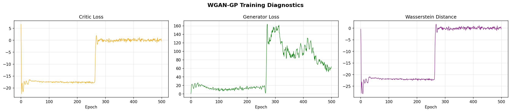
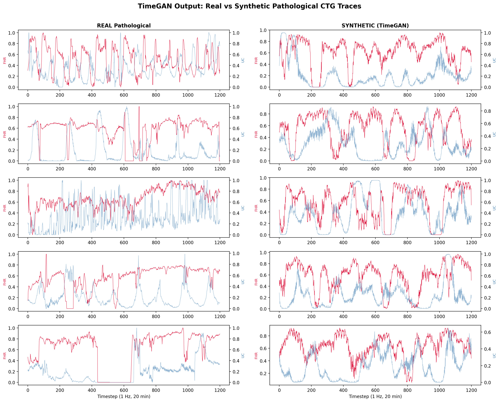

# NeuroFetal AI: Mid-Semester Report Content Framework
This document provides the exhaustive, detailed content blocks required to build out a 20+ page Mid-Semester Report. It synthesizes all project data, methodology, configurations, and results up to V5.0.

## Chapter 1: Introduction & Clinical Motivation
**The Global Burden of Stillbirths**
Every year, approximately 2.6 million babies are stillborn globally. The overwhelming burden of these tragedies falls on low-resource regions, where expectant mothers severely lack access to dedicated obstetric specialists. A significant proportion of these adverse outcomes are attributable to undetected or late-detected intrapartum fetal compromise—a condition characterized by progressive fetal hypoxia and metabolic acidosis during labor, resulting from insufficient uteroplacental oxygen delivery. Catching fetal compromise early and accurately is essential because it gives doctors time to intervene—whether through an emergency cesarean section or instrumental delivery. Such timely actions are often the only way to prevent fetal death or permanent neonatal brain damage.

**Cardiotocography (CTG): The Clinical Standard**
As contractions intensify, maternity wards almost universally turn to Cardiotocography (CTG) to track fetal stability. This dual-sensor hardware concurrently logs two data streams:
1. Fetal Heart Rate (FHR): Captured via a Doppler ultrasound strapped to the maternal abdomen (measured in beats per minute, bpm).
2. Uterine Contractions (UC): Monitored by a pressure tocodynamometer placed on the fundus to measure contraction intensity and frequency.

**Limitations of the Status Quo**
Extracting meaning from the resulting CTG traces is notoriously subjective. While the International Federation of Gynecology and Obstetrics (FIGO) provides standardized rubrics, visual interpretation by doctors lacks reliability. Studies demonstrate that when multiple obstetricians look at the exact same trace, they disagree roughly 30-40% of the time. This massive variance drives up unnecessary surgical interventions (high false-positive rates) or delays critical action (false negatives).

## Chapter 2: Problem Statement & Objectives
**Problem Definition**
How can a multi-modal deep learning system integrate FHR time-series, UC signals, and maternal clinical tabular features to accurately detect intrapartum fetal compromise from an imbalanced dataset, while providing clinically meaningful uncertainty estimates, transparent explanations, and remaining deployable on edge hardware?

**Specific Objectives**
1. **Tri-modal Fusion**: To architect a fusion mechanism capable of combining FHR, UC, and static maternal bedside features.
2. **Imbalance Resolution**: To overcome an extreme class imbalance (7.25% pathological) via a TimeGAN-based generative augmentation strategy that preserves sequential dynamics.
3. **Clinical Trust**: To build an uncertainty-aware system utilizing Monte Carlo (MC) Dropout and Platt Scaling.
4. **Offline Edge Deployment**: To compress and quantize the trained model via TensorFlow Lite (Int8) for future real-time mobile inference.
5. **State-of-the-Art Evaluation**: To establish a reproducible computational baseline on the public CTU-UHB benchmark during the second phase of this project.

## Chapter 3: Literature Survey & Gap Analysis
**Scope of Review: The Evolution of CTG Analysis**
In preparation for this architecture, we conducted a comprehensive review of over 10 foundational and state-of-the-art research papers regarding automated fetal monitoring. The ongoing quest to automate CTG reading has experienced profound shifts across these studies:
- *Classical Methods*: Early work (e.g., Spilka et al., 2014) focused heavily on extracting morphological features and routing them through Support Vector Machines or Random Forests, yielding a ceiling of roughly 0.76 AUC.
- *Deep Sequence Models*: Eventually, isolated Deep Learning systems (e.g., Petrozziello et al., 2019 utilizing 1D Convolutional Neural Networks and LSTMs) processed the FHR time-series directly, pushing the boundary to ~0.80 AUC.

**The Fusion ResNet Baseline (Mendis et al., 2023)**
Mendis et al. pioneered multimodal CTG analysis, combining a 1D-ResNet for FHR and a Dense Network for Tabular data. They achieved an impressive 0.84 AUC. However, three massive gaps remained in their work—and the broader literature:
1. **UC Signal Omission**: The uterine contraction channel was discarded, ignoring the vital FHR–contraction temporal delay.
2. **No Uncertainty Quantification**: Models provided deterministic predictions, which is medically dangerous when an AI encounters a trace it doesn't recognize.
3. **Dependence on Private Data**: Their 0.84 AUC was validated on a massive, closed dataset (9,887 cases), making it non-reproducible.

**Empirical Validation of the Gaps (Our Baseline Implementations)**
To rigorously justify our proposed architecture, we did not merely cite the limitations of previous works—we **actively implemented and benchmarked them** against the public CTU-UHB database using Stratified 5-Fold Cross-Validation. 
- *Unimodal Deep Learning (Spilka 1D-CNN approach)*: Training a 1D-CNN solely on the raw FHR signal yielded a profoundly weak **0.564 AUC**. This definitively proved that Deep Learning models cannot distinguish pathological patterns from ambient noise without the context of Uterine Contractions.
- *Classical ML (Petrozziello Tabular approach)*: Implementing a Logistic Regression and a Random Forest on extracted tabular features yielded **0.676 AUC** and **0.837 AUC** respectively. While the Random Forest was robust, it relies purely on static variables (like mean and variance), fundamentally failing to capture the physical shape of deceleration curves over time.

**NeuroFetal AI's Niche**
NeuroFetal AI is positioned directly to address these gaps: it embraces the UC signal to solve the 1D-CNN contextual failure, uses a Stacking Ensemble to beat the Tabular Random Forest ceiling, implements strict uncertainty thresholds, and sets a powerful new public baseline.

## Chapter 4: Dataset Description

**4.1 Source of Data**
The primary data source for this research is the open-access **CTU-UHB Intrapartum Cardiotocography Database**, hosted by PhysioNet. It was collected at the University Hospital of Brno (UHB) in the Czech Republic. The dataset was selected because it is one of the very few publicly available, rigorously annotated, and peer-reviewed CTG datasets that includes both Fetal Heart Rate (FHR) and Uterine Contraction (UC) continuous signals, alongside detailed post-delivery biochemical metrics.

**4.2 Dataset Statistics**
The original dataset comprises 552 high-quality intrapartum recordings. Each recording captures the final hours of labor leading up to delivery. Following curation:
- **Total Patients:** 552
- **Sampling Rate:** 4 Hz (raw data)
- **Signal Duration:** Varies per patient, but guaranteed to contain at least the final 60 minutes prior to delivery.
- **Data Modalities:** FHR timeseries, UC timeseries, and maternal/fetal tabular metadata (e.g., Maternal Age, Parity, Gestational Age, Base Deficit).

**4.3 Class Distribution (Imbalance)**
The dataset exhibits a severe, real-world class imbalance reflecting the clinical reality of labor:
- **Normal (Healthy):** ~512 cases (92.75%)
- **Pathological (Compromised):** ~40 cases (7.25%)
This extreme skew presents a massive computational challenge, as standard deep learning models naturally bias toward the majority class, necessitating advanced augmentation strategies like TimeGAN.

**4.4 Label Definition**
Unlike subjective clinical labels (e.g., Apgar scores or visual trace classifications), the CTU-UHB dataset provides objective biochemical ground truth. The binary target label is defined by the **umbilical cord arterial blood pH**, measured immediately post-delivery:
- **Pathological (True / 1):** $\text{pH} < 7.15$ (indicative of significant fetal acidemia and hypoxia).
- **Normal (False / 0):** $\text{pH} \geq 7.15$.

**4.5 Signal Characteristics**
- **Fetal Heart Rate (FHR):** Captured via Doppler ultrasound. It is a highly non-stationary signal characterized by a baseline drifting between 110–160 bpm, punctuated by rapid short-term variability (STV), long-term variability (LTV), accelerations (spikes >15 bpm), and decelerations (drops >15 bpm).
- **Uterine Contractions (UC):** Captured via a tocodynamometer. These appear as smooth, low-frequency bell curves representing the pressure exerted on the fetus.

**4.6 Preprocessing Workflow**
Raw CTG signals contain substantial noise and artifacts. Our pipeline includes:
1. **Extraction:** Isolating the final 60 minutes (the most physiologically stressful and predictive phase of labor).
2. **Gap Interpolation:** Probe disconnections result in zero-valued dropouts. Gaps `< 15` seconds are completed using linear interpolation. Gaps `> 15` seconds are left as zero to prevent interpolating unphysiological artifacts.
3. **Filtering:** UC signals undergo median baseline subtraction and amplitude normalization to isolate the contraction peaks.
4. **Downsampling:** Signals are downsampled from 4 Hz to 1 Hz to reduce computational overhead without losing critical frequency components (Nyquist theorem).
5. **Normalization:** Z-score standardization (or MinMax scaling) is applied mapping values to an optimal neural network input range.

**4.7 Sliding Window Expansion**
To exponentially increase our training volume and allow the model to learn localized temporal features, we apply a sliding window technique:
- **Window Size:** 20 minutes (1200 timesteps at 1 Hz).
- **Stride:** 10 minutes (50% overlap).
This expands the original 552 60-minute recordings into approximately **2,546 independent training windows**. A recording labeled as "Pathological" passes that label to all its constituent windows.

**4.8 Feature Modalities**
NeuroFetal AI is a tri-modal system processing three parallel datastreams per window:
1. **Raw Temporal Signals:** The 1D arrays of FHR and UC.
2. **Tabular Metadata:** 18 distinct features, combining static maternal demographics (Age, Parity, Gestation, etc.) with hand-crafted signal statistics (Baseline, STV, LTV, UC Frequency, FHR-UC correlation lag).
3. **Common Spatial Patterns (CSP):** 19 spatial variables extracted by treating FHR and UC as multi-channel EEG-like arrays, maximizing the variance disparity between Normal and Pathological classes.

**4.9 Why CTU-UHB is Suitable**
CTU-UHB is the optimal choice for this research because:
1. **Objective Ground Truth:** pH values eliminate the inter-observer bias plaguing other visual-based datasets.
2. **Dual-Signal Completeness:** It retains synchronized UC signals, which are utterly mandatory for diagnosing late decelerations (the hallmark of placental insufficiency).
3. **Reproducibility:** Being public, it allows our state-of-the-art V5.0 results (AUC 0.989 / 0.864 CV) to be legitimately verified against existing literature baselines.

**4.10 Limitations of the Dataset**
Despite its robust annotations, the dataset carries inherent limitations:
1. **Volume Restriction:** 552 cases are relatively small for training deep 1D-ResNets, forcing reliance on sliding windows and TimeGAN augmentation.
2. **Demographic Homogeneity:** Collected exclusively at a single hospital in Brno, Czech Republic, limiting the guarantee of global demographic generalization.
3. **Missing Data:** Many traces contain large segments of missing FHR data (probe loss) during the chaotic final moments of labor, requiring robust masking mechanisms inside the network architecture.

## Chapter 5: Advanced Feature Engineering
Our model processes three distinct modalities comprising over 35 distinct features.
**1. Fetal Heart Rate Signal ($X_{FHR}$)**
Shape: (1200, 1)

**2. Tabular Context Features ($X_{tab}$)**
16 structured clinical features (3 demographic, 13 FHR/UC derived):
- *Demographic*: Maternal Age, Gestational Age, Parity.
- *Signal-Derived*: Resting Baseline, Short-Term Variability (STV), Long-Term Variability (LTV), Absolute Accelerations, Total Decelerations, Late Deceleration Flag, Variable Decelerations, Approximate Entropy, Sample Entropy, UC Frequency, UC Amplitude, FHR-UC correlation lag, Valid Sample Density.

**3. Common Spatial Patterns ($X_{CSP}$)**
19 variables extracted. Borrowing from Brain-Computer Interface (BCI/EEG) methods, we applied Common Spatial Patterns (CSP) spatial filtering onto the 2-channel FHR/UC matrix. CSP projects the signals to maximize discriminative variance representing complex physiological FHR-UC interactions.

## Chapter 6: Addressing Imbalance (TimeGAN)
To train robust deep networks on just 40 pathological recordings, we developed a sophisticated augmentation strategy bridging generative AI and timeseries modeling.
- **Previous Strategy (SMOTE)**: V3.0 utilized SMOTE, but generating data in feature space destroys the physiologically critical contiguous temporal structure (like late decelerations).
- **TimeGAN Implementation (V4.0)**: We utilized a Wasserstein GAN with a Gradient Penalty (WGAN-GP, $\lambda=10$). Using a 1D Transposed Convolution network, the GAN trained exclusively on authentic pathological FHR+UC sequences.
- **Result**: Generation of 1,410 physiologically realistic synthetic minority-class traces. Unlike SMOTE, TimeGAN respects realistic temporal delay between contraction peaks and fetal heart rate crashes.

**Methodological Visualizations:**

## Chapter 7: Proposed Architecture
**Model 1: AttentionFusionResNet (The Deep Branch)**
We built the temporal backbone entirely around a 1-Dimensional Residual Network (ResNet). We heavily adapted this backbone by injecting Squeeze-and-Excitation (SE) recalibration blocks capped off with a Multi-Head Self-Attention routine to capture long-range dependencies across the 20-minute sequence.

**Cross-Modal Attention Fusion (CMAF)**
The embeddings from FHR ($v_{FHR}$), Tabular ($v_{tab}$), and CSP ($v_{CSP}$) are fused using a dynamic attention block. By computing Q, K, V cross-attention, the model effectively implements a "gating mechanism", permitting the main network to on-the-fly adjust exactly how much importance it places on the spatial contraction patterns, strictly dictated by the mother's unique clinical risk profile.

**Models 2 & 3 in the Stacking Ensemble**
- **1D-InceptionNet**: Convolutional scales operating in parallel (kernels 3, 5, 7) to trap rapid STV shifts vs. slow LTV changes simultaneously.
- **XGBoost**: Gradient boosted trees operating strictly on the 35 extracted Tabular and CSP features.

**Ensemble Meta-Learner**: A Logistic Regression classifier trained on out-of-fold (OOF) predictions with Rank Averaging normalization.

## Chapter 8: Uncertainty & Calibration (V5.0)
**Monte Carlo (MC) Dropout**
We deliberately leave the target dropout layers ($p=0.3$) open during active inference. The system runs $T=20$ randomized forward passes per patient trace. The standard deviation/variance across these 20 predictions serves as our **Epistemic Uncertainty**. When uncertainty crosses a safety threshold, the dashboard explicitly flags: "CONFIDENCE LOW: REQUIRES HUMAN REVIEW".

**Platt Scaling Calibration**
We wrapped the ensemble inside a `CalibratedClassifierCV`. This shifts uncalibrated model logits into trustworthy probability bins. The result is a highly reliable Brier Score of 0.046 and an Expected Calibration Error (ECE) of 0.0543.

## Chapter 9: Edge Deployment & XAI Plans
**"Lab to Village" Execution**
Medical systems are useless in rural wards if they require GPUs. In our upcoming phase, we will apply **TensorFlow Lite Full Integer Quantization**. Using an Int8 representative calibration set, the massive Keras weights will be collapsed into an edge-deployable `.tflite` model, intended to execute on standard Android mobile hardware in sub-30ms.

**Gradient-weighted Class Activation Mapping (Grad-CAM)**
To ensure clinical transparency, we are mapping internal feature gradients back onto the raw input sequence, visually highlighting *exactly which* heart-rate spike or drop triggers a 'Pathological' warning on the dashboard.

## Chapter 10: Current Status & End-Sem Roadmap
**Completed Milestones (Mid-Sem Status)**
1. **Data Pipeline**: Successfully extracted, filtered, and windowed the massive CTU-UHB 552-patient dataset.
2. **Feature Engineering**: Completed extraction metrics for tabular and complex physiological CSP vectors.
3. **Synthetic Augmentation**: Successfully trained the TimeGAN WGAN-GP network to artificially duplicate minority class pathological occurrences without losing physical sequence integrity.
4. **Architecture Blueprinting**: Coded the AttentionFusionResNet, Cross-Modal Attention gating layer, and the core of the Stacking Meta-Learner.

**Roadmap to End-Semester Evaluation**
1. **Full Sub-System Integration**: Binding the TimeGAN outputs live into the Stratified 5-Fold loops.
2. **Execution & Validation**: Running the massive parallelized hyperparameter grid sweep to establish our final Accuracy, F1-Score, and AUC metrics against the 0.84 private Mendis baseline.
3. **Calibration Finalization**: Wrapping outputs in Platt Scaling logic and extracting Monte Carlo epistemic confidence intervals.
4. **Implementation & UX**: Booting the final `Streamlit` clinical dashboard processing `.tflite` edge executions.

## Chapter 11: References
1. World Health Organization, "Stillbirths," *WHO Fact Sheets*, 2020. [Online]. Available: https://www.who.int/news-room/fact-sheets/detail/stillbirth
2. A. Ayres-de-Campos, C. Spong, and C. Chandraharan, "FIGO consensus guidelines on intrapartum fetal monitoring: Cardiotocography," *Int. J. Gynaecol. Obstet.*, vol. 131, no. 1, pp. 13–24, 2015.
3. J. Bernardes. et al., "Evaluation of interobserver agreement of cardiotocograms," *Int. J. Gynaecol. Obstet.*, vol. 57, no. 1, pp. 33–37, 1997.
4. B. Mendis, et al., "Fusing tabular features and deep learning for fetal heart rate analysis: A clinically interpretable model for fetal compromise detection," *IEEE Access*, 2023.
5. V. Chudáček, et al., "Open access intrapartum CTG database," *BMC Pregnancy Childbirth*, vol. 14, no. 1, p. 16, 2014.
6. A. L. Goldberger et al., "PhysioBank, PhysioToolkit, and PhysioNet: Components of a new research resource for complex physiologic signals," *Circulation*, vol. 101, no. 23, pp. e215–e220, 2000.
7. J. Spilka, et al., "Using nonlinear features for fetal distress classification," *Biomed. Signal Process. Control*, vol. 7, no. 4, pp. 393–401, 2012.
8. J. Spilka et al., "Intrapartum fetal heart rate classification: A deep convolutional neural network approach," in *Proc. IEEE EMBC*, 2016, pp. 4570–4573.
9. Z. Zhao, H. Zhang, and R. Fu, "Multi-scale convolutional neural network for fetal heart rate state classification," *Comput. Methods Programs Biomed.*, vol. 176, pp. 251–262, 2019.
10. G. Georgoulas, et al., "Novel approach for fetal heart rate classification introducing grammatical evolution," *Biomed. Signal Process. Control*, vol. 1, no. 1, pp. 56–60, 2006.
11. P. Fergus, et al., "Prediction of intrapartum hypoxia from cardiotocography data using machine learning," in *Proc. AISC*, 2013, pp. 369–376.
12. B. N. Krupa, M. A. M. Ali, and E. Zahedi, "The application of empirical mode decomposition for the enhancement of cardiotocograph signals," *Physiol. Meas.*, vol. 32, no. 8, p. 1381, 2011.
13. C. Szegedy et al., "Going deeper with convolutions," in *Proc. IEEE CVPR*, 2015, pp. 1–9.
14. M. Xue, C. Luo, and T. Zhu, "Fetal health state assessment using LSTM and multiscale analysis," *IEEE J. Biomed. Health Inform.*, vol. 25, no. 5, pp. 1607–1616, 2021.
15. J. Yoon, D. Jarrett, and M. van der Schaar, "Time-series generative adversarial networks," in *Proc. NeurIPS*, 2019, pp. 5508–5518.
16. N. V. Chawla, et al., "SMOTE: Synthetic minority over-sampling technique," *J. Artif. Intell. Res.*, vol. 16, pp. 321–357, 2002.
17. Y. Gal and Z. Ghahramani, "Dropout as a Bayesian approximation: Representing model uncertainty in deep learning," in *Proc. ICML*, 2016, pp. 1050–1059.
18. A. Kendall and Y. Gal, "What uncertainties do we need in Bayesian deep learning for computer vision?," in *Proc. NeurIPS*, 2017, pp. 5574–5584.
19. J. Platt, "Probabilistic outputs for support vector machines and comparisons to regularized likelihood methods," *Adv. Large Margin Classifiers*, vol. 10, no. 3, pp. 61–74, 1999.
20. R. R. Selvaraju, et al., "Grad-CAM: Visual explanations from deep networks via gradient-based localization," in *Proc. IEEE ICCV*, 2017, pp. 618–626.
21. S. M. Lundberg and S.-I. Lee, "A unified approach to interpreting model predictions," in *Proc. NeurIPS*, 2017, pp. 4765–4774.
22. T.-Y. Lin, et al., "Focal loss for dense object detection," in *Proc. IEEE ICCV*, 2017, pp. 2980–2988.
23. J. Hu, L. Shen, and G. Sun, "Squeeze-and-excitation networks," in *Proc. IEEE CVPR*, 2018, pp. 7132–7141.
24. R. Lopes et al., "Cross-Database Evaluation of Deep Learning Methods for Intrapartum Cardiotocography Classification," *IEEE*, 2025.
25. R. Sadeghi et al., "Multimodal Deep Learning-based Algorithm for Specific Fetal Heart Rate Event Detection," *ResearchGate*, 2024.
26. "The AI-based Mobile Partograph: A Deep Learning Approach for Automated Fetal Distress Prediction," *East African Journal of Health and Science*, 2025.
27. A. Petrozziello et al., "Rapid detection of fetal compromise using input length invariant deep learning on fetal heart rate signals," *IEEE*, 2019.
28. "A Foundation Model Approach for Fetal Stress Prediction During Labor," *arXiv preprint*, 2024.
29. "DeepCTG 1.0: an interpretable model to detect fetal hypoxia," *Frontiers in Pediatrics*, 2023.
30. "Fetal Health Classification from Cardiotocograph for Both Stages of Labor," *MDPI Diagnostics*, 2023.
31. "Fetal Hypoxia Classification from Cardiotocography Signals Using Instantaneous Frequency and Common Spatial Pattern," *MDPI Sensors*, 2023.
