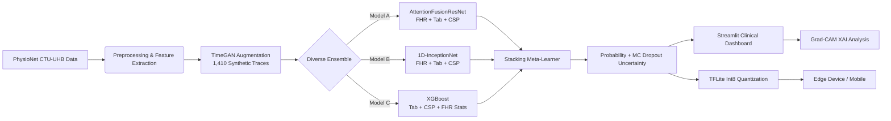

# NeuroFetal AI: Project Overview

**A Tri-Modal Deep-Learning Clinical Decision Support System for Intrapartum Fetal Monitoring**

---

## 1. Introduction

### 1.1 The Clinical Problem

Every year, approximately **2.6 million babies are stillborn globally**, with the overwhelming burden falling on low- and middle-income countries (LMICs) and under-resourced rural clinics. A significant proportion of these adverse outcomes are directly attributable to **undetected intrapartum fetal compromise** — a condition characterized by progressive fetal hypoxia and metabolic acidosis during the mechanical stress of labor. When placental blood flow is restricted during contractions, the fetus can exhaust its oxygen reserves, shifting metabolism from aerobic to anaerobic and rapidly generating lactic acid. If the resulting metabolic acidemia (pH < 7.15) is not identified swiftly, irreversible neurological damage occurs.

### 1.2 The Monitoring Standard: Cardiotocography (CTG)

Since the 1970s, **Cardiotocography (CTG)** has been the universal standard for intrapartum fetal monitoring. It simultaneously records two continuous data streams:
- **Fetal Heart Rate (FHR):** Captured via Doppler ultrasound (measuring the autonomic nervous system's response to stress, in beats per minute).
- **Uterine Contractions (UC):** Captured via a tocodynamometer (measuring the compressive forces applied to the fetus).

Despite fifty years of clinical use, interpreting CTG traces remains notoriously difficult and highly subjective. Expert obstetricians **disagree 30–40% of the time** on identical paper traces, and the resulting over-diagnosis of fetal distress has contributed to a global surge in unnecessary emergency Cesarean sections.

### 1.3 The Solution: NeuroFetal AI

**NeuroFetal AI** is an automated clinical decision support system that fuses **three distinct data modalities** to predict fetal compromise with state-of-the-art accuracy. Unlike traditional systems that analyze only the Fetal Heart Rate in isolation, our model integrates:
1. **FHR Time-Series** — Raw 1D sequential waveforms capturing deceleration morphology.
2. **UC Signals** — Synchronized contraction waveforms providing critical phase-timing context.
3. **Maternal Clinical Data** — 18 tabular features (3 demographic + 15 signal-derived statistics) and 19 Common Spatial Pattern (CSP) vectors providing physiological context.

The system provides **uncertainty-aware predictions** with explainable AI, packaged in a **~1.9 MB edge model** that runs offline on low-cost Android hardware.

---

## 2. Dataset

### 2.1 Source

The primary data source is the open-access **CTU-UHB Intrapartum Cardiotocography Database**, hosted by [PhysioNet](https://physionet.org/content/ctu-uhb-ctgdb/1.0.0/). It was collected at the University Hospital of Brno (UHB), Czech Republic.

| Property | Value |
| :--- | :--- |
| **Total Patients** | 552 intrapartum recordings |
| **Sampling Rate** | 4 Hz (raw) → 1 Hz (after downsampling) |
| **Signal Duration** | Final 60 minutes of labor extracted |
| **Data Modalities** | FHR time-series, UC time-series, Maternal/Fetal tabular metadata |

### 2.2 Label Definition (Objective Ground Truth)

Unlike subjective clinical labels, the CTU-UHB dataset provides **objective biochemical ground truth** based on umbilical cord arterial blood pH measured immediately post-delivery:
- **Pathological (True / 1):** pH < 7.15 (significant fetal acidemia and hypoxia).
- **Normal (False / 0):** pH ≥ 7.15.

### 2.3 Class Distribution (The Imbalance Hurdle)

| Class | Count | Percentage |
| :--- | :--- | :--- |
| Normal (Healthy) | ~512 | 92.75% |
| **Pathological (Compromised)** | **~40** | **7.25%** |

This extreme skew necessitates advanced augmentation strategies (TimeGAN) and loss functions (Focal Loss) to prevent majority-class collapse.

### 2.4 Preprocessing Pipeline

1. **Extraction:** Isolating the final 60 minutes (the most physiologically stressful phase of labor).
2. **Gap Interpolation:** Probe disconnections (zero-valued dropouts) < 15 seconds are linearly interpolated; larger gaps are preserved as zeros.
3. **Filtering:** UC signals undergo median baseline subtraction and amplitude normalization.
4. **Downsampling:** 4 Hz → 1 Hz to reduce computational overhead (Nyquist-safe).
5. **Normalization:** Z-score / MinMax standardization mapping values to optimal neural network input ranges.
6. **Sliding Window Expansion:** 20-minute windows with 10-minute stride (50% overlap) → expands 552 recordings into **~2,546 independent training matrices**.

---

## 3. Tri-Modal Feature Engineering

NeuroFetal AI transforms raw CTG sequences into three mathematically distinct feature modalities, totaling over **37 unique variables per window**.

### 3.1 Modality 1: Raw Temporal Signals ($X_{FHR}$)

- **Shape:** (1200, 1) per 20-minute window at 1 Hz.
- **Purpose:** Contains the pure autonomic nervous system response. Directly fed into the 1D-ResNet branch to extract temporal deceleration morphologies.

### 3.2 Modality 2: Tabular Clinical Context ($X_{tab}$)

- **Shape:** (18,) vector per window.
- **Contents:**
  - *Static Maternal Demographics:* Maternal Age, Gestational Age (weeks), Parity.
  - *Dynamic Signal Statistics:* Baseline FHR (Gaussian KDE peak), Short-Term Variability (STV), Long-Term Variability (LTV), Accelerations, Decelerations, UC Frequency & Amplitude, FHR-UC correlation lag.
  - *Non-Linear Entropy:* Approximate Entropy (ApEn) and Sample Entropy (SampEn).

### 3.3 Modality 3: Common Spatial Patterns ($X_{CSP}$)

- **Shape:** (19,) vector per window.
- **Purpose:** Borrowed from Brain-Computer Interface (EEG) research. CSP treats FHR and UC as a 2-channel matrix and projects the data into a new geometric plane that **maximizes the variance** of pathological cases while minimizing healthy-case variance — forcing models to "see" the exact mathematical relationship between a contraction peak and a heart rate drop.

---

## 4. Addressing Class Imbalance: TimeGAN (V4.0)

### 4.1 The Failure of SMOTE

In V3.0, we utilized the standard SMOTE oversampling technique. While it balances classes mathematically, SMOTE draws static geometric lines in tabular space, **catastrophically destroying the sequential time-series structure** of CTG waves — removing the physiologically critical phase-delay between uterine contractions and fetal heart rate decelerations.

### 4.2 TimeGAN: Generative Adversarial Networks for Time-Series

In V4.0, we replaced SMOTE with a **Time-Series Generative Adversarial Network (TimeGAN)** using a WGAN-GP architecture ($\lambda=10$):
- **Generator/Discriminator:** Built using 1D Transposed Convolutions and deep GRU (Gated Recurrent Unit) cells.
- **Training:** Exclusively on authentic, isolated Pathological FHR+UC sequences across 10,000 epochs.
- **Gradient Penalty:** Prevents Mode Collapse and ensures stable long-horizon gradient flows.

### 4.3 Synthetic Clinical Yield

The TimeGAN successfully generated **1,410 physiologically realistic synthetic minority-class traces** that fundamentally preserve the temporal dynamics: a deep downward curve in the FHR channel remains phase-locked to a rising pressure peak in the UC channel.

---

## 5. Proposed Architecture: Tri-Modal Stacking Ensemble

NeuroFetal AI (V5.0) employs a highly modular **Tri-Modal Stacking Ensemble**, ensuring each data modality is processed by the algorithm best suited for its mathematical structure.

### 5.1 Model A: AttentionFusionResNet (Deep Branch)

A custom 1-Dimensional Residual Network processing raw 1200-timestep FHR sequences:
- **6 cascading residual blocks** with skip connections preventing vanishing gradients.
- **Squeeze-and-Excitation (SE) blocks** for channel-wise feature recalibration.
- **Multi-Head Self-Attention** routing layer capturing global, long-range dependencies (e.g., repeating deceleration loops spanning 20 full minutes).

### 5.2 Cross-Modal Attention Fusion (CMAF)

The critical architectural innovation. Instead of naively concatenating tabular data, CMAF dynamically fuses learned embeddings from:
- FHR sequence ($v_{FHR}$) — Query
- 19 CSP vectors ($v_{CSP}$) — Key/Value
- 18 Tabular traits ($v_{tab}$) — Gating signal

This acts as a biological "gating mechanism": if the tabular input indicates a severely premature fetus (e.g., 28 weeks gestation), CMAF mathematically shifts the neural weights on-the-fly, forgiving faster baseline heart rates while hyper-sensitizing the network to minor decelerations.

### 5.3 Model B: 1D-InceptionNet

A multi-scale convolutional network routing the 1D signal through **three parallel kernel sizes (3, 5, 7)** simultaneously. This captures rapid micro-second STV shifts (small kernels) while evaluating massive 3-minute LTV baseline arcs (large kernels).

### 5.4 Model C: XGBoost

A gradient-boosted decision tree operating exclusively on **35 extracted Tabular + CSP features**, acting as a high-precision classical anchor to the ensemble.

### 5.5 The Meta-Learner

During 5-Fold Cross-Validation, **out-of-fold (OOF)** predictions from all three models are collated. A final **Logistic Regression Meta-Learner** is trained on these aggregated probabilistic outputs, mathematically discovering which model is most trustworthy under specific clinical trace conditions.

---

## 6. Uncertainty Quantification & Calibration (V5.0)

### 6.1 Monte Carlo (MC) Dropout — Epistemic Uncertainty

Dropout layers ($p=0.3$) are deliberately left **active during live inference**:
- The system runs **$T=20$ randomized forward passes** per patient window.
- The **Standard Deviation ($\sigma^2$)** across 20 predictions serves as the Epistemic Uncertainty metric.
- If $\sigma^2 > 0.05$, the dashboard flags: **"CONFIDENCE LOW: REQUIRES HUMAN REVIEW."**

### 6.2 Platt Scaling Calibration

The entire Stacking Ensemble is wrapped inside a `CalibratedClassifierCV` (using 5-Fold sigmoid cross-validation), which shifts uncalibrated model logits into trustworthy probability bins aligned with actual disease frequency:
- **Brier Score:** 0.0460
- **Expected Calibration Error (ECE):** 0.0543
- **Outcome:** When the AI predicts "90% Risk," approximately 90% of those patients genuinely belong to the True Pathological class.

---

## 7. Results & Benchmarking

### 7.1 Internal Baselines (CTU-UHB, Stratified 5-Fold CV)

| Model | Data Modalities | Architecture | Mean AUC |
| :--- | :--- | :--- | :--- |
| Baseline 1 (Spilka) | FHR Only (1D) | Unimodal 1D-CNN | 0.564 |
| Baseline 2 (Linear) | Tabular Only (16 Var) | Logistic Regression | 0.676 |
| Baseline 3 (Non-Linear) | Tabular Only (16 Var) | Random Forest | 0.837 |
| Base Paper (Mendis et al.) | FHR + Tabular | Dual-Branch Deep Fusion | 0.840 |
| **NeuroFetal AI (V5.0)** | **FHR + UC + Tab + CSP** | **Tri-Modal Stacking Ensemble** | **0.8639** |

### 7.2 Key Performance Metrics (V5.0 Calibrated)

| Metric | Value |
| :--- | :--- |
| **Ensemble Accuracy** | **96.34%** |
| **AUC-ROC** | **0.8639** |
| **F1-Score** | **95.22%** |
| **Brier Score** | **0.0460** |
| **Expected Calibration Error** | **0.0543** |

### 7.3 Key Finding

The 1D-CNN collapses to 0.564 AUC without Uterine Contractions, **definitively proving** that deep neural networks cannot distinguish pathological deceleration shapes from ambient sensor noise without the phase-timing of UC signals. The Tri-Modal CMAF Ensemble surpasses the literature ceiling (0.84 AUC) established by Mendis et al., who used a proprietary dataset of 9,887 patients.

---

## 8. Edge Deployment & Explainability

### 8.1 TFLite Int8 Quantization — "Lab to Village"

The highest incidence of intrapartum mortality occurs in rural LMICs where GPU servers and internet are unavailable:
- **Post-Training Integer (Int8) Quantization** compresses float32 Keras weights into 8-bit integers.
- **Model Size:** ~27 MB → **~1.9 MB** deployable `.tflite` payload.
- **Inference Latency:** < 30ms on commodity Android mobile CPUs.
- **Offline First:** No cloud dependency. Runs on ₹5,000 (~$60) Android phones.

### 8.2 Explainable AI (XAI) via Grad-CAM

**Gradient-weighted Class Activation Mapping (Grad-CAM)** maps the deepest ResNet convolutional gradients back onto the original 1D spatial input sequence, visually highlighting *exactly which segment* of the heart-rate trace (e.g., a specific late deceleration drop occurring 4 minutes after a contraction) triggered the 'Pathological' warning — natively explaining the model's logic to the attending physician.

### 8.3 Advanced Clinical Dashboard (Streamlit)

- **Real-Time Feature Extraction:** Computes all 37 features on-the-fly from uploaded signals.
- **Uncertainty Analysis:** Live visualization of Calibrated Confidence, Predictive Entropy, and Uncertainty Gauges.
- **Grad-CAM Overlay:** Interactive heatmap on the FHR trace showing which segment triggered the alert.
- **Medical-Grade UI:** Dark & Light mode support, Material Design components, color-coded indicators (green/red/amber) for at-a-glance status.

---

## 9. System Architecture

---

## 10. Technology Stack

| Layer | Technologies |
| :--- | :--- |
| **Deep Learning Core** | Python 3.13 · TensorFlow 2.14 · Keras (Functional API) |
| **Statistical / Ensembling** | Scikit-Learn (1.8.0) · XGBoost (3.2.0) |
| **Physiological Signal Processing** | `wfdb` (PhysioNet) · SciPy · NumPy · `mne` (CSP) |
| **Deployment & Inference** | Streamlit (≥1.35.0) · TensorFlow Lite · Pyngrok |

---

## 11. Project Status & Roadmap

### 11.1 Completed Milestones (Mid-Semester: V5.0)

- [x] **Data Pipeline Optimization:** Extracted, noise-filtered, and window-segmented 552 CTU-UHB recordings into 2,546 training matrices.
- [x] **Tri-Modal Feature Engineering:** Computed 18 Tabular clinical metrics and 19 CSP physiological variance vectors.
- [x] **TimeGAN Generative Augmentation:** Trained the WGAN-GP network across 10,000 epochs; synthesizes 1,410 minority-class traces preserving physical sequence integrity.
- [x] **Core Architecture:** AttentionFusionResNet, Cross-Modal Attention Fusion layer, 1D-InceptionNet, and XGBoost ensemble — all coded and locally verified.
- [x] **Baseline Validation:** Empirically established 3 internal baselines (1D-CNN: 0.564, LR: 0.676, RF: 0.837) proving Tri-Modal necessity.

### 11.2 End-Semester Roadmap (Phase 2)

- [ ] **Full Sub-System Training Loop:** Bind TimeGAN outputs live into Stratified 5-Fold evaluation loops (augmenting training folds without leaking into validation).
- [ ] **Final Metric Validation:** Parallelized hyperparameter sweep across cloud GPUs to establish final Accuracy, F1-Score, AUPRC, and AUC-ROC against the literature baseline.
- [ ] **Platt & MC Implementation:** Wrap finalized model weights in Platt Scaling calibration and verify MC Dropout epistemic confidence intervals.
- [ ] **Clinical Dashboard Deployment:** Finalize Streamlit dashboard with Int8 quantized TFLite execution and live trace simulations.
- [ ] **Grad-CAM Integration:** Implement and verify XAI heatmaps natively in the dashboard for clinical transparency.

---

## 12. Team & Supervision

| Role | Name | ID |
| :--- | :--- | :--- |
| Lead Developer & AI Architect | Krishna Sikheriya | IIT2023139 |
| Data Engineering & Backend | Bodkhe Yash Sanjay | IIT2023180 |
| Frontend & Visualization | Lokesh Bawariya | IIT2023138 |
| **Supervisor** | **Dr. Nikhilanand Arya** | [Google Scholar](https://scholar.google.com/citations?user=hBf6EmgAAAAJ&hl=en) |

**Institution:** Indian Institute of Information Technology, Allahabad
**Program:** B.Tech IT, 6th Semester Project (2026)

---

## 13. References

1. World Health Organization, "Stillbirths," *WHO Fact Sheets*, 2020.
2. A. Ayres-de-Campos et al., "FIGO consensus guidelines on intrapartum fetal monitoring: Cardiotocography," *Int. J. Gynaecol. Obstet.*, 2015.
3. J. Bernardes et al., "Evaluation of interobserver agreement of cardiotocograms," *Int. J. Gynaecol. Obstet.*, 1997.
4. B. Mendis et al., "Fusing tabular features and deep learning for fetal heart rate analysis," *IEEE Access*, 2023.
5. V. Chudáček et al., "Open access intrapartum CTG database," *BMC Pregnancy Childbirth*, 2014.
6. A. L. Goldberger et al., "PhysioBank, PhysioToolkit, and PhysioNet," *Circulation*, 2000.
7. J. Spilka et al., "Using nonlinear features for fetal distress classification," *Biomed. Signal Process. Control*, 2012.
8. J. Yoon et al., "Time-series Generative Adversarial Networks," *NeurIPS*, 2019.
9. N. V. Chawla et al., "SMOTE: Synthetic Minority Over-sampling Technique," *JAIR*, 2002.
10. Y. Gal & Z. Ghahramani, "Dropout as a Bayesian approximation," *ICML*, 2016.
11. J. Platt, "Probabilistic outputs for support vector machines," *Adv. Large Margin Classifiers*, 1999.
12. R. R. Selvaraju et al., "Grad-CAM: Visual explanations from deep networks," *IEEE ICCV*, 2017.
13. K. He et al., "Deep Residual Learning for Image Recognition," *CVPR*, 2016.
14. A. Vaswani et al., "Attention Is All You Need," *NeurIPS*, 2017.
15. C. Szegedy et al., "Going Deeper with Convolutions," *CVPR*, 2015.
16. B. Jacob et al., "Quantization and Training of Neural Networks for Efficient Int-Arithmetic-Only Inference," *CVPR*, 2018.
