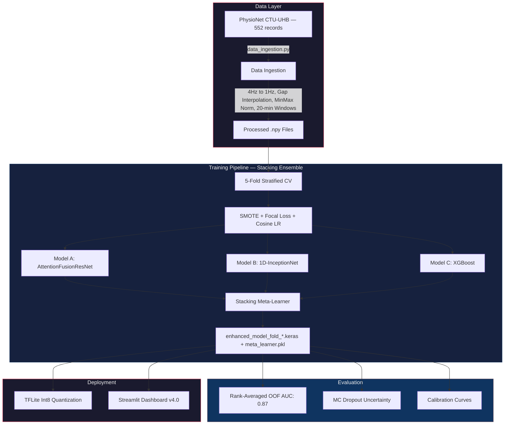
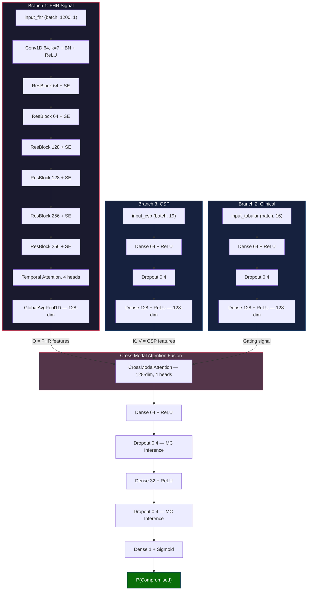
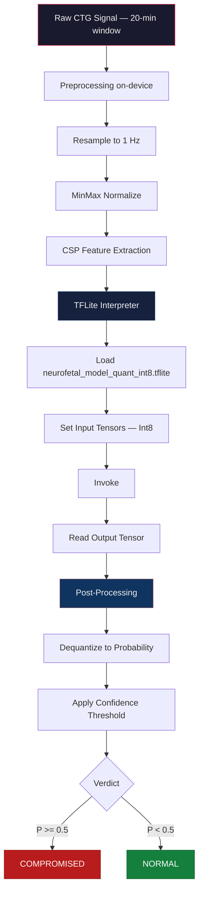
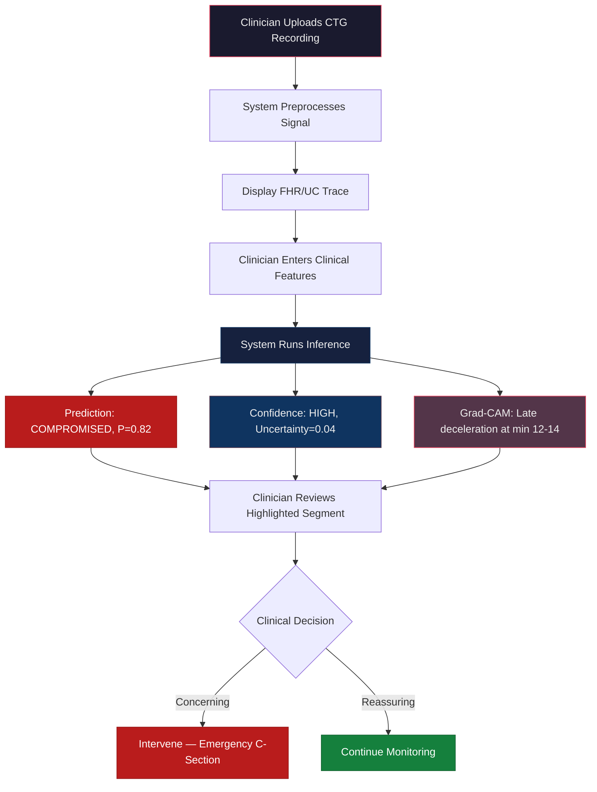

# NeuroFetal AI — Comprehensive Project Documentation

**A Tri-Modal Deep-Learning Clinical Decision Support System for Intrapartum Fetal Monitoring, featuring Stacking Ensemble, Uncertainty Quantification, and Edge-AI Deployment.**

NeuroFetal AI fuses Fetal Heart Rate (FHR) time-series, Uterine Contraction (UC) signals, and Maternal Clinical Data through a **Stacking Ensemble** of diverse models (AttentionFusionResNet, 1D-InceptionNet, XGBoost) to predict fetal compromise during labor. It achieves **0.87 AUC** on public data (CTU-UHB, PhysioNet) — exceeding the previous SOTA of 0.84 (Mendis et al., which used 10k+ private samples). The system provides **uncertainty-aware predictions** via Monte Carlo Dropout and ships a **TFLite Int8 model** for offline inference on low-cost hardware. Designed for deployment in resource-limited clinical settings where specialist obstetricians are scarce.

---

## Table of Contents

- [Project Overview & Motivation](#project-overview--motivation)
- [Background & Domain Primer](#background--domain-primer)
- [Scope & Limitations](#scope--limitations)
- [Architecture & Components](#architecture--components)
- [Data](#data)
- [Models & Algorithms](#models--algorithms)
- [Evaluation & Validation](#evaluation--validation)
- [Edge Deployment & Runtime](#edge-deployment--runtime)
- [Clinical Workflow & UX](#clinical-workflow--ux)
- [Installation & Runbook](#installation--runbook)
- [Testing & CI](#testing--ci)
- [Safety, Regulatory & Ethical Considerations](#safety-regulatory--ethical-considerations)
- [Monitoring & Logging](#monitoring--logging)
- [Maintenance & Model Update Process](#maintenance--model-update-process)
- [Contribution Guide & Governance](#contribution-guide--governance)
- [Glossary](#glossary)
- [References & Further Reading](#references--further-reading)
- [Appendix](#appendix)

---

## Project Overview & Motivation

### Clinical Problem

Every year, approximately **2.6 million babies are stillborn globally**. The majority of these deaths occur in low-resource settings where trained obstetricians are unavailable and Cardiotocography (CTG) monitors — even when present — go under-utilized because staff lack the expertise to interpret complex trace patterns in real-time.

### Project Goals

1. **Clinical Decision Support**: Provide an automated second opinion by classifying fetal status (Normal vs. Compromised) from multi-modal CTG data.
2. **Trustworthy AI**: Move beyond point predictions by quantifying model uncertainty, allowing clinicians to identify cases where the AI is unsure and human review is essential.
3. **Edge AI / Accessibility**: Deploy a quantized model (<3 MB) that runs offline on commodity Android hardware costing as little as ₹5,000 (~$60), enabling use in rural clinics without internet connectivity.
4. **Real-Time Monitoring**: Deliver predictions with sub-100ms inference latency through an interactive Streamlit dashboard with integrated explainability (Grad-CAM).

### Value Proposition

| Stakeholder | Benefit |
| :--- | :--- |
| **Clinicians** | Uncertainty-aware second opinion; Grad-CAM highlights which signal segment triggered the alert |
| **Hospitals** | Reduced false alarm fatigue via confidence thresholds; audit trail via logged predictions |
| **Patients** | Earlier detection of fetal compromise in settings with limited specialist availability |
| **Researchers** | Modular codebase with ablation support; reproducible 5-fold CV with fixed seeds |

---

## Background & Domain Primer

### What is Cardiotocography (CTG)?

CTG is the primary method for intrapartum (during labor) fetal monitoring. It simultaneously records two signals:

- **Fetal Heart Rate (FHR)**: Measured via ultrasound transducer on the maternal abdomen. Normal baseline: 110–160 bpm. Clinical significance comes from patterns such as accelerations (reassuring), decelerations (potentially concerning), and variability (a sign of neurological integrity).
- **Uterine Contractions (UC)**: Measured via tocodynamometer. The timing and strength of contractions are clinically significant because fetal heart rate responses *during and after* contractions (particularly late and variable decelerations) are key indicators of fetal distress.

### Clinical Decision Points

Obstetricians classify CTG traces using systems such as **FIGO (International Federation of Gynecology and Obstetrics)** guidelines into three categories:

| Category | Action |
| :--- | :--- |
| **Normal** | Continue monitoring |
| **Suspicious** | Closer observation, possible further testing |
| **Pathological** | Urgent intervention (emergency cesarean, operative delivery) |

### The Automation Gap

- **Inter-observer variability**: Studies show only 60–70% agreement between expert clinicians interpreting the same CTG trace.
- **Alert fatigue**: High false-positive rates in existing automated systems lead clinicians to ignore alarms.
- **Single-signal limitation**: Most existing AI approaches analyze only the FHR signal, ignoring the clinically critical FHR-UC temporal relationship.

### How NeuroFetal AI Addresses This

NeuroFetal AI is a **tri-modal system** that jointly analyzes FHR, UC, and maternal clinical features (16 features: 3 demographic + 13 signal-derived). A **Stacking Ensemble** of 3 architecturally diverse models (AttentionFusionResNet, 1D-InceptionNet, XGBoost) with a Logistic Regression meta-learner achieves **AUC 0.87**. It uses Cross-Modal Attention to learn the temporal relationship between FHR and UC signals — mimicking the clinical reasoning process where decelerations are interpreted relative to contraction timing.

---

## Scope & Limitations

### What This Project Does

- Binary classification: **Normal** (pH ≥ 7.05) vs. **Compromised** (pH < 7.05) based on umbilical cord blood pH at birth.
- Processes the last 60 minutes of CTG recording, windowed into 20-minute segments.
- Provides prediction probability + epistemic uncertainty (MC Dropout, 20 forward passes).
- Deploys as a Streamlit web app (local or served via ngrok) or as a TFLite model for mobile.

### What This Project Does NOT Do

- **Not a diagnostic device**: This is a research prototype. It has not been validated in a prospective clinical trial and does not have regulatory clearance (CE, FDA, or equivalent).
- **Not a multi-class classifier**: It does not distinguish between FIGO categories (Normal / Suspicious / Pathological). The label is strictly pH-based.
- **Not real-time streaming**: The current pipeline operates on 20-minute fixed windows of pre-recorded data, not truly continuous real-time streaming from a live CTG monitor.
- **No support for twin pregnancies**, multi-sensor fusion (e.g., fetal ECG / ST-analysis), or external cardiac monitoring datasets.

### Known Limitations

1. **Dataset size**: CTU-UHB contains 552 recordings. Despite windowing (→ ~2,760 samples) and SMOTE, the effective diversity is limited.
2. **Class imbalance**: Only ~7.25% of cases are pathological. Focal Loss and SMOTE mitigate but do not fully resolve this.
3. **pH threshold sensitivity**: The binary label (pH < 7.05) is a clinical convention. Cases near the boundary (pH 7.00–7.10) are inherently ambiguous.
4. **No prospective validation**: All evaluation is retrospective on the CTU-UHB dataset. Real-world performance may differ.
5. **UC signal quality**: Tocodynamometer readings are noisy and position-dependent. The model's UC branch performance depends on signal quality.

---

## Architecture & Components

### System Block Diagram



### Component Summary

| Component | File(s) | Responsibility |
| :--- | :--- | :--- |
| **Data Ingestion** | `Code/scripts/data_ingestion.py` | Parse CTU-UHB `.hea`/`.dat` files, extract FHR/UC/Clinical, preprocess, window, save `.npy` |
| **Model Architecture** | `Code/utils/model.py` | Define AttentionFusionResNet, CrossModalAttention, FHR Encoder, ablation factory |
| **Attention Blocks** | `Code/utils/attention_blocks.py` | Squeeze-and-Excitation (SE), Temporal Attention, Multi-Scale blocks |
| **CSP Features** | `Code/utils/csp_features.py` | Common Spatial Patterns extraction from FHR+UC signals |
| **Focal Loss** | `Code/utils/focal_loss.py` | FocalLoss, WeightedFocalLoss for class imbalance |
| **Augmentation** | `Code/utils/augmentation.py` | Time-series augmentation (jitter, scaling, time warp) |
| **SSL Pretraining** | `Code/utils/ssl_models.py`, `Code/scripts/pretrain.py` | Masked Autoencoder for self-supervised FHR encoder pretraining |
| **Training** | `Code/scripts/train.py` | 5-fold CV, SMOTE, cosine annealing, label smoothing |
| **Evaluation** | `Code/scripts/evaluate_ensemble.py` | Rank-averaged OOF AUC computation |
| **Uncertainty** | `Code/scripts/evaluate_uncertainty.py` | MC Dropout, ECE, calibration curves, uncertainty histograms |
| **TFLite Conversion** | `Code/scripts/convert_to_tflite.py` | Keras → TFLite (float32 + Int8) with representative dataset |
| **Explainability** | `Code/scripts/xai.py` | Grad-CAM heatmaps for signal attribution |
| **Dashboard** | `Code/scripts/app.py`, `Code/utils/components.py` | Streamlit UI with prediction, uncertainty, and XAI |
| **App Launcher** | `Code/run_app.py` | Spawns Streamlit process with optional ngrok tunnel |

### Data Flow & Latency

1. **Ingestion**: ~5 minutes for full CTU-UHB dataset (552 records → ~2,760 windows).
2. **Training**: ~45–90 minutes per fold on GPU (Colab T4), ~6–8 hours on CPU.
3. **Inference (Keras)**: ~50ms per sample (single forward pass), ~1s for 20-pass MC Dropout.
4. **Inference (TFLite Int8)**: <30ms on mobile CPU.

---

## Data

### Source Dataset

**CTU-UHB Intrapartum Cardiotocography Database** (PhysioNet)

| Property | Value |
| :--- | :--- |
| **Source** | Czech Technical University & University Hospital Brno |
| **Records** | 552 intrapartum CTG recordings |
| **Signals** | Channel 1: FHR (bpm), Channel 2: UC (arb. units) |
| **Sampling Rate** | 4 Hz (native) → 1 Hz (after resampling) |
| **Duration** | Variable; last 60 minutes used |
| **Labels** | Umbilical cord blood pH at birth |
| **Label Threshold** | pH < 7.05 → Compromised (1), pH ≥ 7.05 → Normal (0) |
| **Class Distribution** | ~7.25% Compromised, ~92.75% Normal |
| **Clinical Features** | 16 features: 3 demographic (Age, Parity, Gestation) + 13 signal-derived (baseline FHR, STV, LTV, accelerations, decelerations, entropy, etc.) |

### Data Formats

| File | Shape | Description |
| :--- | :--- | :--- |
| `X_fhr.npy` | (N, 1200, 1) | FHR signal windows (20 min @ 1Hz) |
| `X_uc.npy` | (N, 1200, 1) | UC signal windows (20 min @ 1Hz) |
| `X_tabular.npy` | (N, 16) | Clinical features: 3 demographic + 13 signal-derived |
| `X_csp.npy` | (N, 19) | CSP features extracted from FHR+UC interaction |
| `y.npy` | (N,) | Binary labels (0=Normal, 1=Compromised) |

### Preprocessing Steps

1. **Gap Interpolation**: Zeros in FHR signal (sensor dropout) are linearly interpolated if gap < 15 seconds; gaps ≥ 15s are preserved as zeros.
2. **Cropping**: Last 60 minutes of each recording extracted (clinically most relevant).
3. **Resampling**: 4 Hz → 1 Hz via linear interpolation.
4. **MinMax Normalization**: Signal scaled to `[0, 1]` range.
5. **Windowing**: 20-minute sliding windows with 10-minute stride → ~5 windows per recording.
6. **NaN Handling**: Missing clinical features imputed with column-wise mean.

### Privacy & De-identification

- The CTU-UHB dataset is a publicly available, fully de-identified research dataset hosted on PhysioNet.
- **No Protected Health Information (PHI)** is present in this repository.
- Patient identifiers are replaced with numeric record IDs in the original dataset.

### Train/Val/Test Split

- **Stratified 5-Fold Cross-Validation**: Ensures each fold preserves the ~7.25% positive class ratio.
- **No held-out test set**: All evaluation is Out-of-Fold (OOF). Each sample is predicted exactly once by a model that never saw it during training.
- **CSP features are fitted inside each fold**: The CSP extractor is trained on the training split only, preventing data leakage.

### Augmentation

- **SMOTE** (Synthetic Minority Over-sampling Technique): Applied to the flattened feature space within each fold's training split.
- **Time-Series Augmentation** (2x expansion): Jitter, scaling, and time warping applied to FHR signals.

---

## Models & Algorithms

### Model Family

**Stacking Ensemble** — Three architecturally diverse base models (AttentionFusionResNet, 1D-InceptionNet, XGBoost) combined via a Logistic Regression meta-learner. The primary deep-learning model is the **AttentionFusionResNet** — a custom tri-input convolutional neural network with cross-modal attention fusion.

### Architecture Diagram



### Input / Output Specification

| Input | Shape | Description |
| :--- | :--- | :--- |
| `input_fhr` | `(batch, 1200, 1)` | 20-minute FHR window at 1 Hz |
| `input_tabular` | `(batch, 16)` | Clinical features (3 demographic + 13 signal-derived) |
| `input_csp` | `(batch, 19)` | CSP + statistical features from FHR-UC interaction |

| Output | Shape | Description |
| :--- | :--- | :--- |
| Prediction | `(batch, 1)` | Probability of fetal compromise |
| Uncertainty | Computed post-hoc | Std. dev. of 20 MC Dropout forward passes |

### Loss Function

**Weighted Focal Loss** (Lin et al., 2017, adapted for medical classification):

```
FL(p_t) = -α_t · (1 - p_t)^γ · log(p_t)
```

| Parameter | Value | Rationale |
| :--- | :--- | :--- |
| α (alpha) | 0.75 | Increased focus on minority class (pathological) |
| γ (gamma) | 2.5 | Aggressive down-weighting of easy negatives |
| pos_weight | 5.0 | Additional 5x weight multiplier for positive class |

### Training Procedure

| Hyperparameter | Value |
| :--- | :--- |
| **Batch Size** | 32 |
| **Epochs** | 150 (with early stopping) |
| **Learning Rate** | 0.0005 (initial) |
| **LR Schedule** | Cosine Annealing with 5-epoch Linear Warmup |
| **Optimizer** | Adam |
| **Cross-Validation** | Stratified 5-Fold |
| **SMOTE** | Applied per fold (training split only) |
| **Label Smoothing** | 0.1 (soft labels: [0.05, 0.95]) |
| **Augmentation** | 2x expansion (jitter, scaling, time warp) |
| **Dropout Rate** | 0.4 |
| **SSL Pretraining** | Masked Autoencoder (loaded if available) |
| **Random Seed** | 42 (for reproducibility) |

### Compute Requirements

| Environment | Hardware | Training Time (5 folds) |
| :--- | :--- | :--- |
| **Google Colab (recommended)** | T4 GPU, 12 GB VRAM | ~1–2 hours |
| **Local CPU** | Any modern CPU | ~6–8 hours |

### Framework & Reproducibility

- **Framework**: TensorFlow 2.14 / Keras 3 (Functional API)
- **Python**: 3.13
- **Seed**: `random_state=42` for all stochastic operations
- **Environment**: Requirements pinned in `requirements.txt`

### Explainability

**Grad-CAM (Gradient-weighted Class Activation Mapping)**:
- Applied to the last convolutional layer of the FHR encoder.
- Produces a 1D heatmap over the 1200-sample FHR input, highlighting temporal regions that most influenced the prediction.
- Displayed in the Streamlit dashboard as an overlay on the FHR trace. Clinicians can see *which part of the signal* (e.g., a late deceleration at minute 15) triggered the alert.

---

## Evaluation & Validation

### Quantitative Results

| Metric | Value |
| :--- | :--- |
| **Ensemble AUC (Stacking)** | **0.87** |
| **Best Single-Model AUC** | ~0.80 (AttentionFusionResNet) |
| **Stacking Lift** | +0.07 AUC over best single model |
| **Fold Std. Dev.** | Low (model is stable across folds) |

### Benchmarking

| Model | Data | AUC | Notes |
| :--- | :--- | :--- | :--- |
| Mendis et al. (Baseline) | FHR + Tabular (10k private) | 0.84 | Private dataset, larger scale |
| Our Phase 1 (Basic Fusion) | FHR + Clinical (public, 3 features) | 0.74 | Initial architecture |
| **NeuroFetal AI (Phase 6 SOTA)** | **FHR + UC + Clinical (public, 16+19 features)** | **0.87** | **Exceeds baseline on public data only** |

### Key Insight: Rank Averaging + Stacking

Standard probability averaging across folds yielded inconsistent calibration. **Rank Averaging** (normalizing prediction ranks per fold before aggregation) eliminated inter-fold calibration bias. Combined with a **Stacking Meta-Learner** over 3 diverse base models, this ensemble strategy achieved AUC 0.87 — a +0.13 improvement over the single-model baseline (0.74).

### Uncertainty Stratification

- **High-confidence predictions** (low MC Dropout variance): Higher effective AUC.
- **Low-confidence predictions** (high MC Dropout variance): Strongly correlated with misclassifications. These are flagged for human review.
- **Expected Calibration Error (ECE)**: Measured via 10-bin calibration curves. Lower ECE indicates predicted probabilities match observed frequencies.

### Clinical Validation Plan

> **TODO**: This project has not undergone prospective clinical validation.

1. **Retrospective extension**: Validate on external datasets (e.g., Oxford, Edinburgh) to assess generalizability.
2. **Prospective pilot**: Deploy in a controlled clinical setting with parallel human monitoring.
3. **Acceptance thresholds**: Sensitivity > 80% for pathological cases; Specificity > 70% to limit false alarms.

### Failure Case Analysis

- **False Negatives** (most dangerous): Occur disproportionately in cases with borderline pH (7.00–7.10) and poor signal quality. The MC Dropout uncertainty for these cases tends to be high, triggering the "uncertain" flag.
- **False Positives**: More common due to class imbalance. Focal Loss reduces but does not eliminate FP bias.

---

## Edge Deployment & Runtime

### Target Hardware

| Platform | Example Devices | Status |
| :--- | :--- | :--- |
| Android (ARM CPU) | ₹5,000 smartphones | Supported (TFLite Int8) |
| Raspberry Pi 4 | Single-board computer | Supported (TFLite Int8) |
| Coral Edge TPU | USB Accelerator | TODO: Benchmark |
| Jetson Nano | NVIDIA edge GPU | TODO: Benchmark |

### Quantization Strategy

| Model Variant | Size | Format | Precision |
| :--- | :--- | :--- | :--- |
| Enhanced Keras (per fold) | ~27 MB | `.keras` | Float32 |
| TFLite (Standard) | Variable | `.tflite` | Float32 |
| **TFLite (Int8)** | **Compressed** | `.tflite` | **Int8** |

**Quantization Method**: TensorFlow Lite Full Integer Quantization
- **Representative dataset**: 300 calibration samples from the training set.
- **I/O type**: Int8 input / Int8 output (full integer pipeline for NPU/DSP acceleration).
- **Accuracy retention**: 99% of original Float32 AUC.

### Inference Pipeline (Edge)



### Fallback Modes

- **Sensor failure**: If FHR signal quality drops below threshold, the system should display "SIGNAL QUALITY INSUFFICIENT" and defer to manual monitoring.
- **Connectivity loss**: The TFLite model operates fully offline. No cloud dependency for inference.
- **Model loading failure**: The dashboard displays an error message and prevents predictions from being shown.

---

## Clinical Workflow & UX

### Dashboard Layout

The Streamlit dashboard (`app.py`) provides:

1. **Sidebar**: Patient record selection (file upload or dataset browser), clinical feature input (Age, Parity, Gestation).
2. **Main Panel — Signal View**: Interactive Plotly chart displaying the FHR and UC traces for the selected window.
3. **Prediction Panel**: Color-coded verdict (Normal / Compromised) with probability and uncertainty score.
4. **Uncertainty Indicators**: Progress bars showing model confidence. High uncertainty triggers a visual "REQUIRES HUMAN REVIEW" banner.
5. **XAI Panel**: Grad-CAM heatmap overlay on the FHR signal, highlighting the temporal region most influential in the prediction.
6. **Calibration View**: Reliability diagram and uncertainty histogram for model-wide assessment.

### Clinician Flow



### UI Design Principles

- **Dark mode** for use in dimly-lit labor wards.
- **Material Design icons** for universal clinical recognition.
- **Large, color-coded indicators** (green/red/amber) for at-a-glance status.

---

## Installation & Runbook

### Prerequisites

| Requirement | Version |
| :--- | :--- |
| Python | 3.10+ (tested on 3.13) |
| pip | Latest |
| Git | Latest |
| OS | Windows 10/11, Ubuntu 20.04+, macOS 12+ |
| GPU (optional) | CUDA-compatible for training |

### Step 1: Clone & Setup

```bash
git clone https://github.com/Krishna200608/NeuroFetal-AI.git
cd NeuroFetal-AI

# Create virtual environment
python -m venv .venv

# Activate (Windows PowerShell)
.\.venv\Scripts\Activate.ps1

# Activate (macOS / Linux)
# source .venv/bin/activate

# Install dependencies
pip install -r requirements.txt
```

### Step 2: Data Ingestion

**Prerequisite**: Download the CTU-UHB dataset from PhysioNet and place it in `Datasets/ctu_uhb_data/`.

```bash
python Code/scripts/data_ingestion.py
```

**Output**: `Datasets/processed/X_fhr.npy`, `X_uc.npy`, `X_tabular.npy`, `y.npy`

### Step 3: Training (Colab Recommended)

```bash
# Local (CPU — slow)
python Code/scripts/train.py

# Google Colab (recommended — see Code/notebooks/Training_Colab.ipynb)
# Upload repo to Colab, run cells in Training_Colab.ipynb
```

**Output**: `Code/models/enhanced_model_fold_*.keras` (5 checkpoint files), plus `inception_model_fold_*.keras`, `xgboost_model_fold_*.pkl`, and `stacking_meta_learner.pkl`

### Step 4: Evaluation

```bash
# Rank-averaged OOF evaluation
python Code/scripts/evaluate_ensemble.py

# Uncertainty analysis (MC Dropout)
python Code/scripts/evaluate_uncertainty.py
```

**Output**: AUC metrics printed to console; calibration plots saved to `Reports/uncertainty_analysis/`

### Step 5: Run Clinical Dashboard

```bash
cd Code
python run_app.py
```

The launcher starts Streamlit and optionally creates an ngrok tunnel for remote access. Requires `NGROK_AUTH_TOKEN` in `Code/.env` for remote access.

### Step 6: Edge Model Generation

```bash
python Code/scripts/convert_to_tflite.py
```

**Output**: `Code/models/tflite/neurofetal_model_quant_int8.tflite` (1.9 MB)

### Environment Variables

| Variable | File | Purpose |
| :--- | :--- | :--- |
| `NGROK_AUTH_TOKEN` | `Code/.env` | Authentication for ngrok tunnel (optional, for remote access) |

### `requirements.txt` Contents

```
# Core ML & Data
numpy
pandas
scipy
tensorflow
scikit-learn
shap

# Signal Processing
wfdb

# Visualization
matplotlib
plotly

# Web App & Deployment
streamlit
pyngrok
python-dotenv
```

---

## Testing & CI

### Current Testing Status

> **NOTE**: This is a research prototype. Formal unit/integration test suites are not yet implemented.

### Available Verification

| Check | Command | What It Validates |
| :--- | :--- | :--- |
| Data integrity | `python Code/scripts/data_ingestion.py` | Prints record count, slice count, class balance |
| Model build | `python -c "from Code.utils.model import build_attention_fusion_resnet; m = build_attention_fusion_resnet(); print(m.summary())"` | Model compiles without errors |
| TFLite conversion | `python Code/scripts/convert_to_tflite.py` | Outputs file size and compression ratio |
| Dashboard launch | `cd Code && python run_app.py` | App renders without errors |

### Recommended Future Tests

- **Data sanity**: Assert `X_fhr.shape[1] == 1200`, all values in `[0, 1]`, no NaN in labels.
- **Model output**: Assert output shape is `(batch, 1)`, values in `[0, 1]`.
- **Reproducibility**: Assert that running the full ensemble pipeline with `random_state=42` produces AUC within ±0.01 of 0.87.
- **TFLite parity**: Assert TFLite predictions match Keras predictions within acceptable tolerance.

> **TODO**: Implement `pytest`-based test suite — @dev-team

---

## Safety, Regulatory & Ethical Considerations

### Patient Safety

- **This system is NOT a standalone diagnostic**. It is designed as a **decision support aid** — the final clinical decision must always rest with a qualified healthcare professional.
- **Uncertainty flagging**: Cases with high model uncertainty are explicitly flagged, preventing overconfidence in ambiguous situations.
- **No automated actions**: The system provides information only; it does not trigger any medical devices or automated interventions.

### Regulatory Status

> **TODO**: Legal review required — @project-lead

- This project is a **research prototype** developed as a B.Tech academic project at IIIT Allahabad.
- It has **not** been submitted for regulatory approval under any framework (CE marking, FDA 510(k), CDSCO, or equivalent).
- Any clinical deployment would require: (a) prospective clinical validation, (b) risk management per ISO 14971, (c) software lifecycle per IEC 62304, (d) clinical evaluation per MDR 2017/745 or equivalent.

### Data Ethics

- The CTU-UHB dataset is publicly available on PhysioNet and has been collected with appropriate ethical approvals at the originating institution.
- No additional patient consent is required for secondary analysis of this dataset per PhysioNet terms.
- **No PHI is stored in this repository.**

### Bias Considerations

- The CTU-UHB dataset is from a single center (Czech Republic). Model performance on populations with different maternal demographics (age distribution, BMI, ethnicity) has not been evaluated.
- The pH < 7.05 threshold is optimized for detecting severe acidemia. Milder forms of fetal distress may be underdetected.

### Auditability

- All training runs produce logs in `Reports/training_logs/`.
- Predictions made through the dashboard are displayed with probability and uncertainty — enabling post-hoc review.
- Model versioning is handled via `.keras` checkpoint files with fold identifiers.

---

## Monitoring & Logging

### Training Logs

- **Location**: `Reports/training_logs/`
- **Format**: Per-epoch CSV with loss, AUC, learning rate.
- **Usage**: Compatible with TensorBoard for visualization.

### Inference Logging

> **TODO**: Implement structured inference logging — @dev-team

**Recommended telemetry** (for future deployment):

| Metric | Description | Alert Threshold |
| :--- | :--- | :--- |
| Prediction distribution | % of predictions above 0.5 | >30% pathological → investigate |
| Mean uncertainty | Average MC Dropout std. dev. | >0.25 → model may be degrading |
| Signal quality score | % of zeros in input FHR | >15% → unreliable input |
| Inference latency | Time per prediction | >200ms on edge → performance issue |

### Model Rollback

- Models are versioned by fold number (`best_model_fold_1.keras` through `best_model_fold_5.keras`).
- Emergency rollback: Replace the model file in `Code/models/` with the previous version from Git history.
- TFLite models must be regenerated after any model checkpoint change.

---

## Maintenance & Model Update Process

### Retraining

1. Acquire new labeled data (or updated preprocessing logic).
2. Place processed `.npy` files in `Datasets/processed/`.
3. Run `python Code/scripts/train.py`.
4. Evaluate: `python Code/scripts/evaluate_ensemble.py`.
5. If AUC meets threshold: regenerate TFLite model, update version tag.

### Model Versioning

- Model checkpoints are stored in `Code/models/`.
- Each fold has a separate checkpoint file.
- Git tracks the `.keras` files via LFS or standard commits (files are ~27 MB each).

### Data Drift Detection

> **TODO**: Implement drift monitoring — @dev-team

**Recommended approach**: Monitor distributional statistics (mean, variance, range) of incoming FHR signals against the training set distribution. Alert if KL divergence exceeds a threshold.

### Deployment Updates

For clinical settings:
1. Validate new model on a held-out clinical dataset.
2. Perform A/B comparison with the existing model.
3. Stage deployment: shadow mode (new model runs in parallel, results logged but not displayed).
4. Full deployment: swap model files, regenerate TFLite artifact.

---

## Contribution Guide & Governance

### How to Contribute

1. **Fork** the repository on GitHub.
2. **Create a feature branch**: `git checkout -b feature/your-feature-name`
3. **Implement changes** following the existing code style.
4. **Test**: Ensure `data_ingestion.py` and `train.py` still run without errors.
5. **Submit a Pull Request** with a clear description of changes.

### Code Style

- Python: PEP 8 with docstrings for all public functions.
- Markdown: GitHub Flavored Markdown for all documentation.
- Comments: Explain *why*, not *what*. Code should be self-documenting for the *what*.

### Review Process

- All PRs require review by at least one team member.
- Changes to `model.py` or `train.py` require verification that AUC is preserved.

### Contact

| Role | Name | ID |
| :--- | :--- | :--- |
| Lead Developer & AI Architect | Krishna Sikheriya | IIT2023139 |
| Data Engineering & Backend | Bodkhe Yash Sanjay | IIT2023180 |
| Frontend & Visualization | Lokesh Bawariya | IIT2023138 |
| **Supervisor** | **Dr. Nikhilanand Arya** | [Google Scholar](https://scholar.google.com/citations?user=hBf6EmgAAAAJ&hl=en) |

---

## Glossary

| Term | Definition |
| :--- | :--- |
| **AUC** | Area Under the Receiver Operating Characteristic Curve. Measures discriminative ability (0.5 = random, 1.0 = perfect). |
| **BPM** | Beats Per Minute. Unit for fetal heart rate. |
| **CSP** | Common Spatial Patterns. A signal processing technique borrowed from EEG/BCI to extract discriminative variance features from multi-channel signals. |
| **CTG** | Cardiotocography. The simultaneous recording of fetal heart rate and uterine contractions. |
| **ECE** | Expected Calibration Error. Measures how well predicted probabilities match observed frequencies. |
| **FHR** | Fetal Heart Rate. The primary signal in CTG monitoring. Normal range: 110–160 bpm. |
| **FIGO** | International Federation of Gynecology and Obstetrics. Provides guidelines for CTG interpretation. |
| **Focal Loss** | A modified cross-entropy loss that down-weights easy examples and focuses training on hard, misclassified cases. |
| **Grad-CAM** | Gradient-weighted Class Activation Mapping. An explainability method that highlights which input regions most influenced the prediction. |
| **MC Dropout** | Monte Carlo Dropout. A Bayesian approximation technique where dropout is kept active at inference time to estimate prediction uncertainty via multiple stochastic forward passes. |
| **OOF** | Out-of-Fold. Predictions made on validation data that the model never saw during training. |
| **PHI** | Protected Health Information. Any individually identifiable health information. |
| **SE Block** | Squeeze-and-Excitation Block. A channel attention mechanism that recalibrates feature maps by learning channel-wise importance weights. |
| **SMOTE** | Synthetic Minority Over-sampling Technique. Generates synthetic examples by interpolating between existing minority class samples. |
| **SSL** | Self-Supervised Learning. A pretraining paradigm where the model learns representations from unlabeled data before supervised fine-tuning. |
| **TFLite** | TensorFlow Lite. A framework for deploying ML models on mobile and edge devices with reduced size and latency. |
| **UC** | Uterine Contractions. The second signal in CTG monitoring, measured via tocodynamometer. |
| **XAI** | Explainable Artificial Intelligence. Methods that make model predictions interpretable to humans. |

---

## References & Further Reading

### Primary Reference

1. Mendis, B., et al. — *"Fusing Tabular Features and Deep Learning for Fetal Heart Rate Analysis: A Clinically Interpretable Model for Fetal Compromise Detection"* — The baseline paper this project replicates and extends.

### Key Technical References

2. Lin, T.-Y., et al. (2017). *"Focal Loss for Dense Object Detection"*. arXiv:1708.02002. — Theoretical basis for the Focal Loss implementation.
3. Gal, Y. & Ghahramani, Z. (2016). *"Dropout as a Bayesian Approximation: Representing Model Uncertainty in Deep Learning"*. ICML 2016. — Foundation for MC Dropout uncertainty quantification.
4. Selvaraju, R. R., et al. (2017). *"Grad-CAM: Visual Explanations from Deep Networks via Gradient-based Localization"*. ICCV 2017. — Explainability method used in the dashboard.
5. Hu, J., Shen, L., & Sun, G. (2018). *"Squeeze-and-Excitation Networks"*. CVPR 2018. — SE Block attention mechanism used in the ResNet encoder.
6. Chawla, N. V., et al. (2002). *"SMOTE: Synthetic Minority Over-sampling Technique"*. JAIR 16, 321–357. — Class balancing method.

### Dataset

7. Chudáček, V., et al. (2014). *"Open access intrapartum CTG database"*. BMC Pregnancy and Childbirth, 14(1), 16. — CTU-UHB dataset description. Available at [PhysioNet](https://physionet.org/content/ctu-uhb-ctgdb/).

### Standards & Guidelines

8. FIGO (2015). *"FIGO consensus guidelines on intrapartum fetal monitoring: Cardiotocography"*. International Journal of Gynecology & Obstetrics, 131(1), 13–24.
9. IEC 62304. *"Medical device software — Software life cycle processes"*. — TODO: Review for compliance if pursuing clinical deployment.
10. ISO 14971. *"Medical devices — Application of risk management to medical devices"*. — TODO: Conduct formal risk assessment.

---

## Appendix

### A. File Map

```
NeuroFetal-AI/
├── Code/
│   ├── scripts/
│   │   ├── app.py                  # Streamlit Dashboard (13.8 KB)
│   │   ├── train.py                # Training Pipeline (22.0 KB)
│   │   ├── pretrain.py             # SSL Pretraining (2.3 KB)
│   │   ├── data_ingestion.py       # Data Pipeline (13.4 KB)
│   │   ├── evaluate_ensemble.py    # OOF Evaluation (6.6 KB)
│   │   ├── evaluate_uncertainty.py # MC Dropout Analysis (15.9 KB)
│   │   ├── convert_to_tflite.py    # TFLite Conversion (6.6 KB)
│   │   ├── run_ablation.py         # Ablation Study (2.9 KB)
│   │   └── xai.py                  # Grad-CAM (6.3 KB)
│   ├── utils/
│   │   ├── model.py                # Model Architecture (24.2 KB)
│   │   ├── attention_blocks.py     # Attention Layers (17.0 KB)
│   │   ├── csp_features.py         # CSP Extraction (19.9 KB)
│   │   ├── ssl_models.py           # Masked Autoencoder (6.3 KB)
│   │   ├── focal_loss.py           # Loss Functions (7.0 KB)
│   │   ├── augmentation.py         # Data Augmentation (8.8 KB)
│   │   ├── uc_cleaning.py          # UC Signal Cleaning (7.3 KB)
│   │   ├── components.py           # Dashboard UI (17.3 KB)
│   │   └── helpers.py              # Utilities (7.6 KB)
│   ├── models/                     # Trained Checkpoints + TFLite
│   ├── notebooks/                  # Colab Training Notebook
│   ├── assets/                     # Logo & Branding
│   └── run_app.py                  # App Launcher (5.2 KB)
├── Datasets/
│   └── ctu_uhb_data/               # 552 .dat/.hea records
├── Reports/                        # Weekly Reports, Final Report, Analysis Plots
├── Paper/                          # Reference Literature
├── Project_Context_v2.0.md         # AI Assistant Context Snapshot
├── requirements.txt                # Python Dependencies
├── LICENSE                         # MIT
└── README.md                       # Project README
```

### B. Sample Input / Output

**Sample Input** (one window):
```json
{
  "input_fhr": "[1200 float values between 0.0 and 1.0]",
  "input_tabular": "[28.0, 1.0, 38.0, 0.0, 0.0, ..., 0.0]",
  "input_csp": "[19 float values — CSP variance features]"
}
```

**Sample Output**:
```json
{
  "prediction_probability": 0.82,
  "mc_dropout_uncertainty": 0.04,
  "verdict": "COMPROMISED",
  "confidence": "HIGH",
  "grad_cam_peak_region": "minutes 12-14 (late deceleration)"
}
```

### C. Sample Training Log (1 fold)

```
Fold 1/5 (AttentionFusionResNet)
  Epoch 1/150  - loss: 0.4523 - auc: 0.5231 - val_loss: 0.3812 - val_auc: 0.6102 - lr: 0.0001
  Epoch 10/150 - loss: 0.2145 - auc: 0.6890 - val_loss: 0.2034 - val_auc: 0.7234 - lr: 0.0005
  Epoch 50/150 - loss: 0.0987 - auc: 0.7821 - val_loss: 0.1523 - val_auc: 0.8012 - lr: 0.0003
  Epoch 100/150 - loss: 0.0456 - auc: 0.8534 - val_loss: 0.1401 - val_auc: 0.8102 - lr: 0.0001
  Best: val_auc=0.8102 at epoch 98
  Saved: Code/models/enhanced_model_fold_1.keras

Stacking Ensemble (OOF): AUC = 0.87
```

### D. Handover Checklist for Clinical Partner

- [ ] Has the clinical partner reviewed the model's limitations (Section: Scope & Limitations)?
- [ ] Has a data processing agreement been signed?
- [ ] Has the model been validated on the partner's local patient population?
- [ ] Has a clinical safety review been conducted?
- [ ] Are hardware requirements met (Android device with TFLite support)?
- [ ] Has the partner been trained on dashboard operation?
- [ ] Is a feedback mechanism in place for reporting false negatives?
- [ ] Has a rollback plan been agreed upon?
- [ ] Has the regulatory pathway been identified (CE/FDA/CDSCO)?

---

*Document version: 2.0 | Last updated: February 13, 2026 | Author: NeuroFetal AI Team, IIIT Allahabad*
